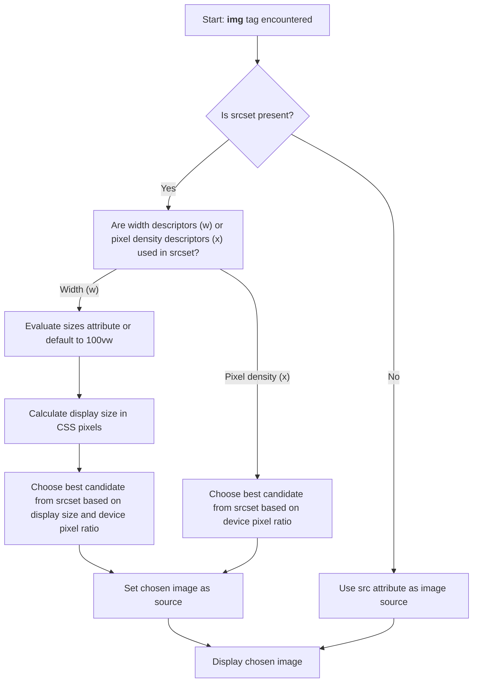
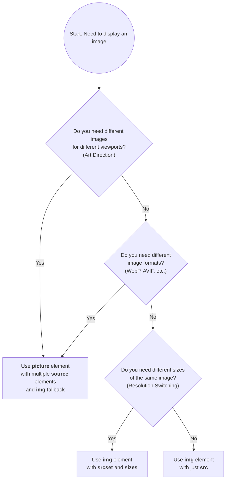

# Images in HTML

## Overview

The `` tag and the `<picture>` tag are used to embed images in a web page. The `` tag displays a single image, while the `<picture>` tag provides multiple image sources for different device settings (screen size, media type, pixel density).

---

## `` Element Attributes

| Attribute       | Description                                                                 | Example Value / Usage                                                                                 |
|-----------------|-----------------------------------------------------------------------------|------------------------------------------------------------------------------------------------------|
| `src`           | **Required.** Image file URL or path.                                       | `src="image.jpg"`                                                                                    |
| `alt`           | Alternative text for the image (for accessibility, SEO, and fallback).      | `alt="A description of the image"`                                                                   |
| `width`         | Width of the image (in CSS pixels).                                         | `width="300"`                                                                                        |
| `height`        | Height of the image (in CSS pixels).                                        | `height="200"`                                                                                       |
| `srcset`        | List of image sources for responsive images (with descriptors).             | `srcset="img-320w.jpg 320w, img-480w.jpg 480w, img-800w.jpg 800w"`                                   |
| `sizes`         | Specifies image display sizes for different viewport widths (used with srcset). | `sizes="(max-width: 600px) 480px, 800px"`                                                            |
| `loading`       | Lazy loading behavior: `lazy`, `eager`, or `auto`.                         | `loading="lazy"`                                                                                     |
| `crossorigin`   | CORS settings: `anonymous`, `use-credentials`.                             | `crossorigin="anonymous"`                                                                            |
| `usemap`        | Associates the image with a client-side image map.                         | `usemap="#mapname"`                                                                                  |
| `ismap`         | Boolean. Indicates the image is part of a server-side image map.           | `ismap`                                                                                              |
| `referrerpolicy`| Referrer policy for fetch requests.                                        | `referrerpolicy="no-referrer"`                                                                       |
| `decoding`      | Decoding mode: `sync`, `async`, or `auto`.                                 | `decoding="async"`                                                                                   |

---

## Basic Image Example

```html

```

---

## Responsive Images Example

```html

```

**Explanation:**
- `src`: Fallback image source (used if `srcset` is not supported)
- `loading="lazy"`: Defer loading until image is near the viewport (performance optimization)
- `srcset`: Responsive image sources with width descriptors (intrinsic width of each image)
- `sizes`: Media queries telling the browser how wide the image will be displayed at different viewport sizes
- `alt`: Alternative text for accessibility, SEO, and when image fails to load

---

## Attribute Details

### `src`
- The main image file to display.

### `alt`
- Text shown if the image can't be displayed.
- **Important for accessibility!**

### `width` & `height`
- Control the display size in **CSS pixels** (rendered size).
- Helps browsers reserve space and avoid layout shifts (prevents Cumulative Layout Shift / CLS).
- Always specify both `width` and `height` for better performance.
- The browser uses these values to calculate the aspect ratio before the image loads.

### `srcset`
- List of images with width descriptors (`w`) or pixel density descriptors (`x`).
- **Width descriptors (`w`)**: Specify the intrinsic width of each image in pixels.
  - Example: `srcset="img-400.jpg 400w, img-800.jpg 800w"`
  - Used with `sizes` attribute for resolution switching.
- **Pixel density descriptors (`x`)**: Specify the pixel density ratio.
  - Example: `srcset="img-1x.jpg 1x, img-2x.jpg 2x"`
  - Used for serving higher resolution images to high-DPI displays.
- The browser selects the most appropriate image based on viewport size and device pixel ratio.

### `sizes`
- Tells the browser how much space the image will take up at different viewport sizes (in **CSS pixels** - rendered size).
- Used **with** `srcset` (width descriptors) to help the browser choose the optimal image source.
- Syntax: `sizes="(media-query) size, (media-query) size, default-size"`
- The browser evaluates media queries from left to right and uses the first matching one.
- If omitted, defaults to `100vw` (full viewport width).
- Size values can be:
  - Fixed: `500px`
  - Viewport-relative: `50vw`, `100vw`
  - CSS calc: `calc(100vw - 20px)`

#### Examples:

**Basic example:**
```html

```
- On screens ≤600px wide: image displays at 500px
- On larger screens: image displays at 1000px
- Browser selects appropriate image from `srcset` based on these sizes

**Multiple breakpoints:**
```html

```
- Mobile (≤480px): image takes full viewport width (`100vw`)
- Tablet (481px-1024px): image takes half viewport width (`50vw`)
- Desktop (>1024px): fixed 800px width

**Percentage-based sizing:**
```html

```
- On mobile: 90% of viewport width
- On larger screens: 60% of viewport width

**Fixed size (no media queries):**
```html

```
- Image always displays at 500px regardless of viewport size
- Browser still selects appropriate source from `srcset` based on device pixel ratio

**Note:** If `sizes` is omitted when using width descriptors (`w`), the browser assumes the image is `100vw` (full viewport width).

### `loading`
- Controls when the browser loads the image.
- `lazy`: Defer loading until image is near viewport (recommended for images below the fold).
- `eager`: Load immediately (default, use for above-the-fold images).
- `auto`: Default browser behavior (same as `eager`).
- **Best practice**: Use `lazy` for most images to improve initial page load performance.

### `crossorigin`
- For CORS-enabled images (e.g., for canvas use).

### `usemap` & `ismap`
- For image maps (clickable areas).

### `referrerpolicy`
- Controls the referrer information sent when fetching the image.

### `decoding`
- Suggests how the browser should decode the image.
- `async`: Decode asynchronously (non-blocking, recommended).
- `sync`: Decode synchronously (blocks rendering).
- `auto`: Browser decides (default).

---

## The `<picture>` Element

The `<picture>` element provides multiple image sources for different scenarios:
- **Art direction**: Different images for different viewport sizes
- **Format support**: Different image formats (WebP, AVIF, etc.) with fallbacks
- **Resolution switching**: Different image sizes (alternative to `srcset`)

### Structure

```html
<picture>
  <source srcset="..." media="..." sizes="..." type="..." />
  <source srcset="..." media="..." sizes="..." type="..." />
  
</picture>
```

### Example: Art Direction

```html
<picture>
  <source
    srcset="mobile-cropped.jpg"
    media="(max-width: 600px)"
  />
  <source
    srcset="desktop-wide.jpg"
    media="(min-width: 601px)"
  />
  
</picture>
```

### Example: Format Support

```html
<picture>
  <source srcset="image.avif" type="image/avif" />
  <source srcset="image.webp" type="image/webp" />
  
</picture>
```

### Example: Combined Art Direction and Format Support

```html
<picture>
  <!-- Mobile: AVIF format -->
  <source
    srcset="mobile.avif"
    media="(max-width: 600px)"
    type="image/avif"
  />
  <!-- Mobile: WebP fallback -->
  <source
    srcset="mobile.webp"
    media="(max-width: 600px)"
    type="image/webp"
  />
  <!-- Desktop: AVIF format -->
  <source
    srcset="desktop.avif"
    media="(min-width: 601px)"
    type="image/avif"
  />
  <!-- Desktop: WebP fallback -->
  <source
    srcset="desktop.webp"
    media="(min-width: 601px)"
    type="image/webp"
  />
  <!-- Final fallback -->
  
</picture>
```

### `<source>` Element Attributes

- `srcset`: Image source(s) with optional descriptors
- `media`: Media query condition (e.g., `(max-width: 600px)`)
- `sizes`: Display size information (same as `` `sizes`)
- `type`: MIME type of the image (e.g., `image/webp`, `image/avif`)

**Important:** The `` element inside `<picture>` is required and serves as the fallback.

---

**Tip:**  
Always use the `alt` attribute for accessibility and SEO!

---

## Understanding Pixels: CSS Pixels vs Hardware Pixels

### Two Types of Pixels

1. **Rendered Size Pixels (CSS Pixels / Logical Pixels)**
   - Used in CSS and HTML attributes (e.g., `width="300"` or `width: 300px`)
   - Represent a **logical measurement** that remains consistent across devices
   - Device-independent and provide a consistent sizing experience
   - One CSS pixel does not necessarily equal one physical pixel
   - Used by: `width`, `height`, `sizes` attributes

2. **Intrinsic Size Pixels (Hardware Pixels / Physical Pixels)**
   - The actual physical pixels on a device's display
   - Represent the real, physical resolution of the screen
   - Modern devices often have multiple hardware pixels per CSS pixel
   - Used by: `srcset` width descriptors (`w`)

### Device Pixel Ratio (DPR)

- The **device pixel ratio** (DPR) is the relationship between hardware pixels and CSS pixels.
- **Formula**: DPR = Hardware Pixels ÷ CSS Pixels
- **Example**: A device with DPR of 2 means there are 2×2 = 4 hardware pixels for every 1 CSS pixel.
- **Common DPR values**:
  - Standard displays: 1x (1 hardware pixel = 1 CSS pixel)
  - Retina/High-DPI displays: 2x, 3x, or higher

### Why This Matters

- When you set `width="300"` on an image, you're specifying **300 CSS pixels** (rendered size).
- On a 2x display, the browser needs **600 hardware pixels** (intrinsic size) to render that image clearly.
- This is why responsive images with `srcset` and pixel density descriptors (`1x`, `2x`) are important—they allow the browser to download appropriately sized images for the device's pixel density.
- Without proper image sizing:
  - Images can appear blurry on high-DPI displays
  - Bandwidth is wasted on standard displays
  - Layout shifts occur when images load

### Quick Reference

| Attribute | Type of Pixel Used | Description |
|-----------|-------------------|-------------|
| `width`, `height` | Rendered size (CSS pixels) | Display size on screen |
| `sizes` | Rendered size (CSS pixels) | How much space image takes up |
| `srcset` (with `w`) | Intrinsic size (hardware pixels) | Actual image file dimensions |
| `srcset` (with `x`) | Pixel density ratio | Multiplier for device pixel ratio |

---

## Image Selection Logic

The browser follows this decision tree when encountering an `` tag:



**Key Points:**
- If no `srcset`, browser uses `src` attribute
- Width descriptors (`w`) require `sizes` attribute (or defaults to `100vw`)
- Pixel density descriptors (`x`) only need device pixel ratio
- Browser selects image closest to needed size while considering DPR


## Choosing the Right Image Element

Use this flowchart to decide which HTML element and attributes to use:



**Decision Guide:**

1. **Use `<picture>`** when:
   - You need art direction (different crops/compositions for different viewports)
   - You want to serve modern formats (WebP, AVIF) with fallbacks
   - You need both art direction and format support

2. **Use `` with `srcset` and `sizes`** when:
   - You need resolution switching (same image, different sizes)
   - You want the browser to choose the best size based on viewport

3. **Use `` with just `src`** when:
   - Simple use case with a single image
   - No responsive image needs
   - Image is small or performance is not a concern

---

## Best Practices

### Performance
- ✅ Always specify `width` and `height` to prevent layout shifts
- ✅ Use `loading="lazy"` for images below the fold
- ✅ Use `decoding="async"` for non-critical images
- ✅ Provide multiple image sizes via `srcset` to reduce bandwidth
- ✅ Use modern formats (WebP, AVIF) with fallbacks via `<picture>`

### Accessibility
- ✅ Always include descriptive `alt` text
- ✅ Use empty `alt=""` for decorative images (screen readers skip them)
- ✅ Ensure `alt` text conveys the same information as the image

### Responsive Design
- ✅ Use `srcset` with width descriptors for resolution switching
- ✅ Always include `sizes` when using width descriptors
- ✅ Test on different devices and viewport sizes
- ✅ Consider art direction for images that need different crops

### SEO
- ✅ Use descriptive `alt` text for better image search rankings
- ✅ Use descriptive filenames (e.g., `sunset-over-ocean.jpg` vs `img123.jpg`)
- ✅ Optimize image file sizes for faster page loads

