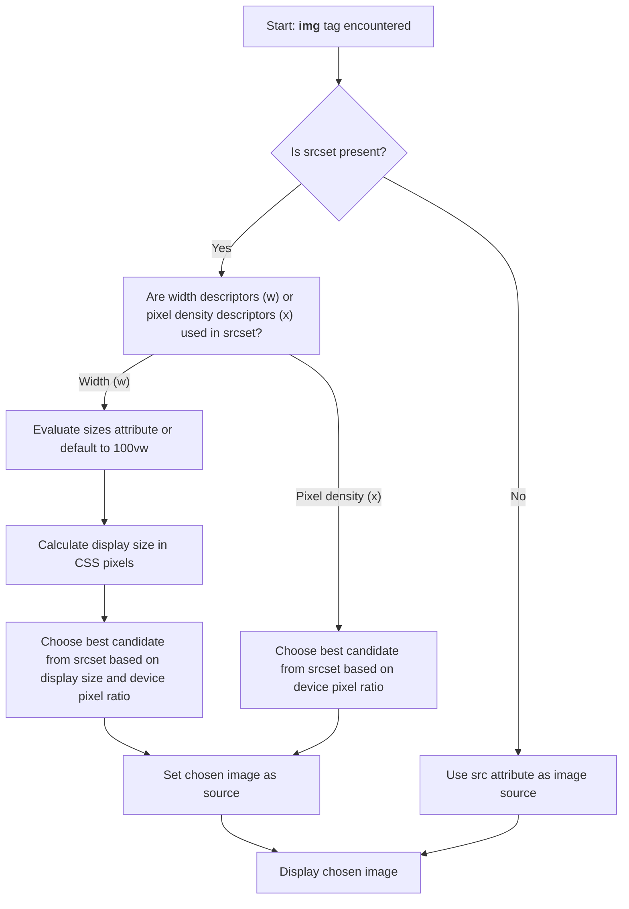
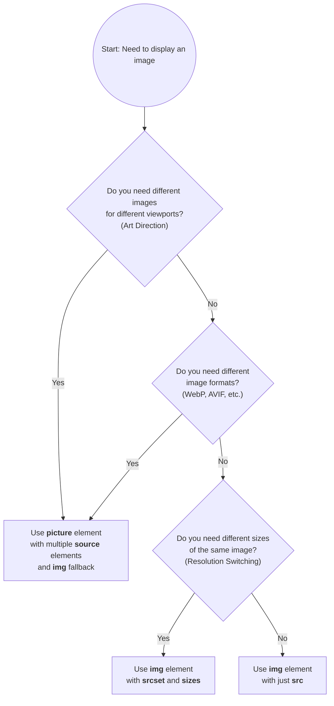

# Images in HTML

A complete guide to embedding and optimizing images: ``, `<picture>`, responsive images, pixel types, and best practices.

## Overview

The `` and `<picture>` elements embed images in a web page. **``** displays a single image (optionally with multiple sources via `srcset`). **`<picture>`** provides multiple sources for different device settings: screen size (art direction), media type (format support), and pixel density (resolution switching).

### At a glance

| Goal | Use |
|------|-----|
| One image, no responsiveness | `` |
| Same image, different sizes (resolution switching) | `` |
| Different crops/compositions per viewport (art direction) | `<picture>` with `<source media="...">` and `` |
| Modern formats with fallback (WebP, AVIF) | `<picture>` with `<source type="...">` and `` |
| Same image, control crop/focus in a fixed ratio | `object-fit: cover` + `object-position` (+ optional `data-focus-*` / CSS variables) |

**Pixels:** Use **rendered size** (CSS pixels) for `width`, `height`, and `sizes`—how big the image appears. Use **intrinsic size** (or density `x`) in `srcset`—the actual image file dimensions the browser chooses from.

---

## Table of contents

1. [\ element attributes](#img-element-attributes)
2. [Basic & responsive examples](#basic-image-example)
3. [Attribute details](#attribute-details) (src, alt, width/height, srcset, sizes, loading, etc.)
4. [The \<picture\> element](#the-picture-element)
5. [Rendered vs intrinsic pixels](#understanding-pixels-rendered-size-vs-intrinsic-size)
6. [Display and cropping](#display-and-cropping) (object-fit, aspect-ratio, focal point)
7. [Srcset logic for picking an image](#srcset-logic-for-picking-an-image)
8. [Choosing the right element](#choosing-the-right-image-element)
9. [Other patterns](#other-patterns)
10. [Best practices](#best-practices)
11. [References](#references)

---

## `` Element Attributes

| Attribute       | Description                                                                 | Example Value / Usage                                                                                 | Pixel type        |
|-----------------|-----------------------------------------------------------------------------|------------------------------------------------------------------------------------------------------|-------------------|
| `src`           | **Required.** Image file URL or path.                                       | `src="image.jpg"`                                                                                    | —                 |
| `alt`           | Alternative text for the image (for accessibility, SEO, and fallback).      | `alt="A description of the image"`                                                                   | —                 |
| `width`         | Width of the image (display size).                                          | `width="300"`                                                                                        | Rendered (CSS)    |
| `height`        | Height of the image (display size).                                         | `height="200"`                                                                                       | Rendered (CSS)    |
| `srcset`        | List of image sources for responsive images (with descriptors).             | `srcset="img-320w.jpg 320w, img-480w.jpg 480w, img-800w.jpg 800w"`                                   | Intrinsic (`w`) or density (`x`) |
| `sizes`         | Specifies image display sizes for different viewport widths (used with srcset). | `sizes="(max-width: 600px) 480px, 800px"`                                                            | Rendered (CSS)    |
| `loading`       | Lazy loading behavior: `lazy`, `eager`, or `auto`.                         | `loading="lazy"`                                                                                     | —                 |
| `fetchpriority` | Hint for load priority: `high` (e.g. LCP hero), `low`, or `auto`.         | `fetchpriority="high"`                                                                               | —                 |
| `crossorigin`   | CORS settings: `anonymous`, `use-credentials`.                             | `crossorigin="anonymous"`                                                                            | —                 |
| `usemap`        | Associates the image with a client-side image map.                         | `usemap="#mapname"`                                                                                  | —                 |
| `ismap`         | Boolean. Indicates the image is part of a server-side image map.           | `ismap`                                                                                              | —                 |
| `referrerpolicy`| Referrer policy for fetch requests.                                        | `referrerpolicy="no-referrer"`                                                                       | —                 |
| `decoding`      | Decoding mode: `sync`, `async`, or `auto`.                                 | `decoding="async"`                                                                                   | —                 |

---

## Basic Image Example

```html

```

---

## Responsive Images Example

```html

```

**Explanation:**
- `src`: Fallback image source (used if `srcset` is not supported)
- `loading="lazy"`: Defer loading until image is near the viewport (performance optimization)
- `srcset`: Responsive image sources with width descriptors (intrinsic width of each image)
- `sizes`: Media queries telling the browser how wide the image will be displayed at different viewport sizes
- `alt`: Alternative text for accessibility, SEO, and when image fails to load

---

## Attribute Details

### `src`
- The main image file to display.

### `alt`
- Text shown if the image can't be displayed.
- **Important for accessibility!**

### `width` & `height`
- Control the display size in **CSS pixels** (rendered size).
- Helps browsers reserve space and avoid layout shifts (prevents Cumulative Layout Shift / CLS).
- Always specify both `width` and `height` for better performance.
- The browser uses these values to calculate the aspect ratio before the image loads.
- Work with CSS `aspect-ratio` and `object-fit` for fixed-ratio containers and cropping (avoids CLS).

### `srcset`
- List of images with width descriptors (`w`) or pixel density descriptors (`x`).
- **Width descriptors (`w`)**: Specify the intrinsic width of each image in pixels.
  - Example: `srcset="img-400.jpg 400w, img-800.jpg 800w"`
  - Used with `sizes` attribute for resolution switching.
- **Pixel density descriptors (`x`)**: Specify the pixel density ratio.
  - Example: `srcset="img-1x.jpg 1x, img-2x.jpg 2x"`
  - Used for serving higher resolution images to high-DPI displays.
- The browser selects the most appropriate image based on viewport size and device pixel ratio.

### `sizes`
- Tells the browser how much space the image will take up at different viewport sizes (in **CSS pixels** - rendered size).
- Used **with** `srcset` (width descriptors) to help the browser choose the optimal image source.
- Syntax: `sizes="(media-query) size, (media-query) size, default-size"`
- The browser evaluates media queries from left to right and uses the first matching one.
- If omitted, defaults to `100vw` (full viewport width).
- Size values can be:
  - Fixed: `500px`
  - Viewport-relative: `50vw`, `100vw`
  - CSS calc: `calc(100vw - 20px)`

#### Examples:

**Basic example:**
```html

```
- On screens ≤600px wide: image displays at 500px
- On larger screens: image displays at 1000px
- Browser selects appropriate image from `srcset` based on these sizes

**Multiple breakpoints:**
```html

```
- Mobile (≤480px): image takes full viewport width (`100vw`)
- Tablet (481px-1024px): image takes half viewport width (`50vw`)
- Desktop (>1024px): fixed 800px width

**Percentage-based sizing:**
```html

```
- On mobile: 90% of viewport width
- On larger screens: 60% of viewport width

**Fixed size (no media queries):**
```html

```
- Image always displays at 500px regardless of viewport size
- Browser still selects appropriate source from `srcset` based on device pixel ratio

**Note:** If `sizes` is omitted when using width descriptors (`w`), the browser assumes the image is `100vw` (full viewport width).

### `loading`
- Controls when the browser loads the image.
- `lazy`: Defer loading until image is near viewport (recommended for images below the fold).
- `eager`: Load immediately (default, use for above-the-fold images).
- `auto`: Default browser behavior (same as `eager`).
- **Best practice**: Use `lazy` for most images to improve initial page load performance.

### `fetchpriority`
- Hints to the browser how to prioritize fetching the image (affects LCP when used on above-the-fold images).
- `high`: Use for the main hero/LCP image so it loads sooner.
- `low`: Use for below-the-fold images to deprioritize them.
- `auto`: Browser decides (default).
- Combine with `loading="eager"` for critical above-the-fold images.

### `crossorigin`
- For CORS-enabled images (e.g., for canvas use).

### `usemap` & `ismap`
- For image maps (clickable areas).

### `referrerpolicy`
- Controls the referrer information sent when fetching the image.

### `decoding`
- Suggests how the browser should decode the image.
- `async`: Decode asynchronously (non-blocking, recommended).
- `sync`: Decode synchronously (blocks rendering).
- `auto`: Browser decides (default).

---

## The `<picture>` Element

The `<picture>` element provides multiple image sources for different scenarios:
- **Art direction**: Different images for different viewport sizes
- **Format support**: Different image formats (WebP, AVIF, etc.) with fallbacks
- **Resolution switching**: Different image sizes (alternative to `srcset`)

### Structure

```html
<picture>
  <source srcset="..." media="..." sizes="..." type="..." />
  <source srcset="..." media="..." sizes="..." type="..." />
  
</picture>
```

### Example: Art Direction

```html
<picture>
  <source
    srcset="mobile-cropped.jpg"
    media="(max-width: 600px)"
  />
  <source
    srcset="desktop-wide.jpg"
    media="(min-width: 601px)"
  />
  
</picture>
```

### Example: Format Support

```html
<picture>
  <source srcset="image.avif" type="image/avif" />
  <source srcset="image.webp" type="image/webp" />
  
</picture>
```

### Example: Combined Art Direction and Format Support

```html
<picture>
  <!-- Mobile: AVIF format -->
  <source
    srcset="mobile.avif"
    media="(max-width: 600px)"
    type="image/avif"
  />
  <!-- Mobile: WebP fallback -->
  <source
    srcset="mobile.webp"
    media="(max-width: 600px)"
    type="image/webp"
  />
  <!-- Desktop: AVIF format -->
  <source
    srcset="desktop.avif"
    media="(min-width: 601px)"
    type="image/avif"
  />
  <!-- Desktop: WebP fallback -->
  <source
    srcset="desktop.webp"
    media="(min-width: 601px)"
    type="image/webp"
  />
  <!-- Final fallback -->
  
</picture>
```

### `<source>` Element Attributes

- `srcset`: Image source(s) with optional descriptors
- `media`: Media query condition (e.g., `(max-width: 600px)`)
- `sizes`: Display size information (same as `` `sizes`)
- `type`: MIME type of the image (e.g., `image/webp`, `image/avif`)

**Important:** The `` element inside `<picture>` is required and serves as the fallback.

**Source order:** `<source>` order matters—the browser uses the first matching source. Put your preferred format or breakpoint first.

---

**Tip:**  
Always use the `alt` attribute for accessibility and SEO!

---

## Display and cropping

CSS controls how an image fits and is cropped inside its box. Use these with `width`/`height` or a wrapper to avoid layout shift (CLS).

### object-fit

How the image is resized inside its box (on `` or replaced elements):

- **`cover`** — Fills the box, keeps aspect ratio, clips overflow. Typical for cards and heroes.
- **`contain`** — Fits the entire image in the box, may letterbox.
- **`fill`** — Stretches to fill the box (may distort).
- **`none`** — No resizing.
- **`scale-down`** — Uses whichever of `none` or `contain` produces a smaller result.

### aspect-ratio

Use to reserve space and prevent CLS; the box keeps a fixed ratio before the image loads. Set on the `` or a wrapper (e.g. `aspect-ratio: 16/9` or `aspect-ratio: 1`). Works with `width` and `height`.

### Focal point images

Cropping an image into a fixed aspect-ratio box while keeping a chosen point (e.g. a face) visible as the viewport or container size changes.

**HTML:** Single `` (optionally with `srcset`/`sizes`). Store the focal point as:

- **Data attributes:** e.g. `data-focus-x="30"` `data-focus-y="40"` (percent), or
- **CSS custom properties** set by CMS/JS: `style="--focus-x: 30%; --focus-y: 40%;"` on a wrapper or the img.

**CSS:** Use together:

- **`object-fit: cover`** — Image fills the box, keeps ratio, clips overflow.
- **`object-position`** — Aligns the image in the box (e.g. `object-position: var(--focus-x) var(--focus-y)` or `50% 30%`). Keywords: `center`, `top`, `left`, etc.; percentages or lengths.
- **`aspect-ratio`** — Fixes the container ratio (e.g. `16/9`, `1`) so layout is predictable.

**Example:**

```html
<div class="focal-image" style="--focus-x: 30%; --focus-y: 40%;">
  
</div>
```

**Note:** Focal point is a *display* choice; it doesn’t change which file is downloaded. Keep using `srcset`/`sizes` for resolution switching. Server-side cropping (different URLs per crop) is an alternative when you need distinct assets.

---

## Understanding Pixels: Rendered Size vs Intrinsic Size

Two pixel concepts matter for images: **rendered size** (how big the image appears on screen) and **intrinsic size** (the actual dimensions of the image file and the device’s pixel density).

### Two Types of Pixels

1. **Rendered size (CSS pixels / logical pixels)**
   - The size of the image **as displayed on the screen**; used for layout.
   - Used in CSS and HTML attributes (e.g., `width="300"` or `width: 300px`).
   - Represents a **logical measurement** that stays consistent across devices.
   - One CSS pixel does not necessarily equal one physical pixel.
   - **Used by:** `width`, `height`, `sizes` attributes.

2. **Intrinsic size (hardware pixels / physical pixels)**
   - The size **as defined by the image file**; accounts for device pixel density.
   - The actual physical pixels on a device’s display (screen resolution).
   - Modern devices often have multiple hardware pixels per CSS pixel.
   - **Used by:** `srcset` width descriptors (`w`); pixel density (`x`) describes a ratio.

### Device Pixel Ratio (DPR)

- The **device pixel ratio** (DPR) is the relationship between hardware pixels and CSS pixels.
- **Formula**: DPR = Hardware Pixels ÷ CSS Pixels
- **Example**: A device with DPR of 2 means there are 2×2 = 4 hardware pixels for every 1 CSS pixel.
- **Common DPR values**:
  - Standard displays: 1x (1 hardware pixel = 1 CSS pixel)
  - Retina/High-DPI displays: 2x, 3x, or higher

### Why This Matters

- When you set `width="300"` on an image, you're specifying **300 CSS pixels** (rendered size).
- On a 2x display, the browser needs **600 hardware pixels** (intrinsic size) to render that image clearly.
- This is why responsive images with `srcset` and pixel density descriptors (`1x`, `2x`) are important—they allow the browser to download appropriately sized images for the device's pixel density.
- Without proper image sizing:
  - Images can appear blurry on high-DPI displays
  - Bandwidth is wasted on standard displays
  - Layout shifts occur when images load

### Quick Reference

| Attribute | Type of Pixel Used | Description |
|-----------|-------------------|-------------|
| `width`, `height` | Rendered size (CSS pixels) | Display size on screen |
| `sizes` | Rendered size (CSS pixels) | How much space image takes up |
| `srcset` (with `w`) | Intrinsic size (hardware pixels) | Actual image file dimensions |
| `srcset` (with `x`) | Pixel density ratio | Multiplier for device pixel ratio |

---

## Srcset logic for picking an image

The flowchart below shows how the browser picks which image source to use when it encounters an `` tag with or without `srcset`.


```mermaid
flowchart TD
    A["`Start: **img** tag encountered`"] --> B{Is srcset present?}
    B -- No --> C[Use src attribute as image source]
    B -- Yes --> D["Are width descriptors (w) or pixel density descriptors (x) used in srcset?"]
    D -- Width (w) --> E[Evaluate sizes attribute or default to 100vw]
    E --> F[Calculate display size in CSS pixels]
    F --> G[Choose best candidate from srcset based on display size and device pixel ratio]
    G --> H[Set chosen image as source]
    D -- Pixel density (x) --> I[Choose best candidate from srcset based on device pixel ratio]
    I --> H
    H --> J[Display chosen image]
    C --> J
```

**Key Points:**
- If no `srcset`, browser uses `src` attribute
- Width descriptors (`w`) require `sizes` attribute (or defaults to `100vw`)
- Pixel density descriptors (`x`) only need device pixel ratio
- Browser selects image closest to needed size while considering DPR


## Choosing the Right Image Element

Use this flowchart to decide which HTML element and attributes to use:


```mermaid
flowchart TD
    A(("Start: Need to display an image"))
    B{"Do you need different images<br/>for different viewports?<br/>(Art Direction)"}
    C{"Do you need different<br/>image formats?<br/>(WebP, AVIF, etc.)"}
    D{"Do you need different sizes<br/>of the same image?<br/>(Resolution Switching)"}
    E["`Use **picture** element<br/>with multiple **source** elements<br/>and **img** fallback`"]
    F["`Use **img** element<br/>with **srcset** and **sizes**`"]
    G["`Use **img** element<br/>with just **src**`"]
    
    A --> B
    B -- Yes --> E
    B -- No --> C
    C -- Yes --> E
    C -- No --> D
    D -- Yes --> F
    D -- No --> G
```

**Decision Guide:**

1. **Use `<picture>`** when:
   - You need art direction (different crops/compositions for different viewports)
   - You want to serve modern formats (WebP, AVIF) with fallbacks
   - You need both art direction and format support

2. **Use `` with `srcset` and `sizes`** when:
   - You need resolution switching (same image, different sizes)
   - You want the browser to choose the best size based on viewport

3. **Use `` with just `src`** when:
   - Simple use case with a single image
   - No responsive image needs
   - Image is small or performance is not a concern

---

## Other patterns

### Priority hints

Use `fetchpriority="high"` on the main hero/LCP image so it loads sooner; use `fetchpriority="low"` for below-the-fold images to deprioritize them.

### Container queries

Images can respond to their **container** width instead of the viewport. Use `container-type` on a wrapper and `@container` in CSS, or use container-relative `sizes` (e.g. in a sidebar vs main content). Example: a card image might use `sizes="(max-width: 400px) 100vw, 50vw"` when the card is in a narrow container.

### Image maps

For clickable regions on a single image, use a **client-side image map**: `<map name="navmap">` with one or more `<area>` elements (e.g. `shape="rect" coords="x1,y1,x2,y2" href="..."`), then `usemap="#navmap"` on the ``. **Server-side image maps** use `ismap` and require server logic to handle click coordinates.

### Decorative images

Use `alt=""` for decorative images so screen readers skip them. For purely decorative visuals with no semantic content, a CSS background image is an alternative to ``.

---

## Best Practices

### Performance
- ✅ Always specify `width` and `height` to prevent layout shifts
- ✅ Use `fetchpriority="high"` on the main hero/LCP image
- ✅ Use `loading="lazy"` for images below the fold
- ✅ Use `decoding="async"` for non-critical images
- ✅ Provide multiple image sizes via `srcset` to reduce bandwidth
- ✅ Use modern formats (WebP, AVIF) with fallbacks via `<picture>`

### Accessibility
- ✅ Always include descriptive `alt` text
- ✅ Use empty `alt=""` for decorative images (screen readers skip them)
- ✅ Ensure `alt` text conveys the same information as the image

### Responsive Design
- ✅ Use `srcset` with width descriptors for resolution switching
- ✅ Always include `sizes` when using width descriptors
- ✅ Test on different devices and viewport sizes
- ✅ Consider art direction for images that need different crops

### SEO
- ✅ Use descriptive `alt` text for better image search rankings
- ✅ Use descriptive filenames (e.g., `sunset-over-ocean.jpg` vs `img123.jpg`)
- ✅ Optimize image file sizes for faster page loads

---

## References

- **MDN — img:** [developer.mozilla.org/en-US/docs/Web/HTML/Element/img](https://developer.mozilla.org/en-US/docs/Web/HTML/Element/img)
- **MDN — picture:** [developer.mozilla.org/en-US/docs/Web/HTML/Element/picture](https://developer.mozilla.org/en-US/docs/Web/HTML/Element/picture)
- **MDN — Responsive images (srcset, sizes):** [developer.mozilla.org/en-US/docs/Learn/HTML/Multimedia_and_embedding/Responsive_images](https://developer.mozilla.org/en-US/docs/Learn/HTML/Multimedia_and_embedding/Responsive_images)
- **MDN — object-fit:** [developer.mozilla.org/en-US/docs/Web/CSS/object-fit](https://developer.mozilla.org/en-US/docs/Web/CSS/object-fit)
- **MDN — object-position:** [developer.mozilla.org/en-US/docs/Web/CSS/object-position](https://developer.mozilla.org/en-US/docs/Web/CSS/object-position)
- **MDN — aspect-ratio:** [developer.mozilla.org/en-US/docs/Web/CSS/aspect-ratio](https://developer.mozilla.org/en-US/docs/Web/CSS/aspect-ratio)
- **web.dev — Responsive images:** [web.dev/learn/design/responsive-images](https://web.dev/learn/design/responsive-images)
