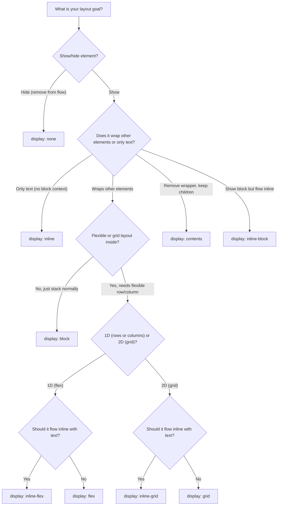

# CSS Display Properties

CSS has several ways to control the display of elements. The `display` property determines how an element is rendered and how it interacts with other elements in the document flow.

## Flowchart: How to Pick a `display` Property



**How to use:**  
- Start at the top and answer each question to choose the correct `display` property for your CSS.
- Refer to the options for specialized needs such as hiding, container removal, grid, or flex layouts.

## Quick Reference Table

| Display Value | External Layout | Internal Layout | Width/Height | Margin/Padding | Use Case |
|:--------------|:----------------|:----------------|:-------------|:---------------|:---------|
| `none` | Removed from flow | N/A | N/A | N/A | Hide elements completely |
| `contents` | Removed (children take place) | N/A | N/A | N/A | Grouping without wrapper |
| `inline` | Flows with text | Content-based | No | Horizontal only | Text-like elements |
| `inline-block` | Flows with text | Content-based | Yes | Yes | Inline with block features |
| `inline-flex` | Flows with text | Flexbox | Yes | Yes | Inline flex container |
| `inline-grid` | Flows with text | Grid | Yes | Yes | Inline grid container |
| `block` | Full width, new line | Content-based | Yes | Yes | Structural elements |
| `flex` | Full width, new line | Flexbox | Yes | Yes | Flexible layouts |
| `grid` | Full width, new line | Grid | Yes | Yes | 2D grid layouts |

## Property Compatibility Reference

### What Works with Each Display Type

| Property | `inline` | `inline-block` | `block` | `flex` | `grid` |
|:---------|:---------|:----------------|:--------|:-------|:-------|
| `width` | ❌ | ✅ | ✅ | ✅ | ✅ |
| `height` | ❌ | ✅ | ✅ | ✅ | ✅ |
| `margin` (all) | ⚠️ Horizontal only | ✅ | ✅ | ✅ | ✅ |
| `padding` (all) | ⚠️ Horizontal affects layout | ✅ | ✅ | ✅ | ✅ |
| `vertical-align` | ✅ | ✅ | ❌ | ❌ | ❌ |
| `text-align` | ❌ (on element) | ❌ (on element) | ✅ | ❌ | ❌ |
| `flexbox properties` | ❌ | ❌ | ❌ | ✅ | ❌ |
| `grid properties` | ❌ | ❌ | ❌ | ❌ | ✅ |
| `float` | ⚠️ Converts to block | ✅ | ✅ | ❌ | ❌ |
| `clear` | ❌ | ✅ | ✅ | ❌ | ❌ |

---

## Detailed Examples

### `display: none`

Completely removes the element from the document flow. The element takes no space and is not rendered.

**Properties:**
- Element is not rendered
- Takes no space in layout
- Not accessible to screen readers (when hidden)
- Can be toggled with JavaScript

**Example:**
```html
<div class="hidden">This is hidden</div>
<div>This appears normally</div>
```

```css
.hidden {
  display: none;
}
```

**Use cases:**
- Toggle visibility with JavaScript
- Hide elements conditionally
- Remove elements from layout calculations

---

### `display: contents`

The element's box is removed, and its children are rendered as if they were direct children of the element's parent.

**Properties:**
- Element's box is invisible
- Children participate in parent's layout
- Useful for semantic grouping without layout impact
- ⚠️ **Warning:** Don't use on interactive elements (buttons, links, inputs)

**Example:**
```html
<div class="wrapper">
  <div class="contents-wrapper">
    <div class="item">Item 1</div>
    <div class="item">Item 2</div>
  </div>
</div>
```

```css
.wrapper {
  display: flex;
  gap: 1rem;
}

.contents-wrapper {
  display: contents; /* Items 1 and 2 become direct flex children of .wrapper */
}

.item {
  padding: 1rem;
  background: lightblue;
}
```

**Use cases:**
- Semantic HTML without layout wrapper
- CSS Grid/Flexbox where wrapper would interfere
- Grouping elements for JavaScript without layout impact

---

### `display: inline`

Element flows with text content. Only takes up as much width as needed.

**Properties:**
- Width/height have no effect
- Vertical margins/padding don't affect layout
- Horizontal margins/padding work
- Flows with text content
- Cannot contain block-level elements

**Example:**
```html
<p>This is a paragraph with <span class="highlight">highlighted text</span> that flows inline.</p>
```

```css
.highlight {
  display: inline;
  background-color: yellow;
  padding: 2px 4px; /* Only horizontal padding affects layout */
  margin: 0 5px; /* Only horizontal margin affects layout */
  /* width: 100px; */ /* ❌ Has no effect */
  /* height: 50px; */ /* ❌ Has no effect */
}
```

**Use cases:**
- Styling text spans
- Emphasizing inline content
- Default for `<span>`, `<a>`, `<em>`, `<strong>`

---

### `display: inline-block`

Hybrid: flows inline like text but respects width, height, and all margins/padding.

**Properties:**
- Flows inline (sits next to other elements)
- Width and height work
- All margins and padding work
- Can contain block-level elements
- Respects vertical alignment

**Example:**
```html
<div class="container">
  <div class="box">Box 1</div>
  <div class="box">Box 2</div>
  <div class="box">Box 3</div>
</div>
```

```css
.container {
  text-align: center; /* Centers inline-block elements */
}

.box {
  display: inline-block;
  width: 150px;
  height: 100px;
  margin: 10px;
  padding: 20px;
  background: lightcoral;
  vertical-align: top; /* Aligns boxes at top */
}
```

**Use cases:**
- Navigation items that need specific dimensions
- Buttons with fixed sizes in a row
- Image galleries
- Elements that need to sit side-by-side with dimensions

---

### `display: inline-flex`

Flexbox container that flows inline (like inline-block) but uses flexbox for its children.

**Properties:**
- Container flows inline
- Children are flex items
- Container respects width/height
- All flexbox properties work on container

**Example:**
```html
<div class="inline-flex-container">
  <div class="flex-item">1</div>
  <div class="flex-item">2</div>
  <div class="flex-item">3</div>
</div>
<span>Text flows after the flex container</span>
```

```css
.inline-flex-container {
  display: inline-flex;
  gap: 10px;
  padding: 10px;
  background: lightgreen;
  /* Container itself flows inline */
}

.flex-item {
  padding: 10px;
  background: white;
  /* These are flex items */
}
```

**Use cases:**
- Icon groups that need flexbox alignment
- Inline navigation with flex spacing
- Tags/badges with flex alignment

---

### `display: inline-grid`

Grid container that flows inline (like inline-block) but uses CSS Grid for its children.

**Properties:**
- Container flows inline
- Children are grid items
- Container respects width/height
- All grid properties work on container

**Example:**
```html
<div class="inline-grid-container">
  <div class="grid-item">A</div>
  <div class="grid-item">B</div>
  <div class="grid-item">C</div>
  <div class="grid-item">D</div>
</div>
<span>Text continues inline</span>
```

```css
.inline-grid-container {
  display: inline-grid;
  grid-template-columns: repeat(2, 50px);
  grid-template-rows: repeat(2, 50px);
  gap: 5px;
  padding: 10px;
  background: lightblue;
}

.grid-item {
  background: white;
  display: flex;
  align-items: center;
  justify-content: center;
}
```

**Use cases:**
- Inline icon grids
- Small inline data tables
- Inline card layouts

---

### `display: block`

Element takes full width and starts on a new line.

**Properties:**
- Takes full available width
- Starts on new line
- Width and height work
- All margins and padding work
- Can contain other block and inline elements

**Example:**
```html
<div class="block-element">Block 1</div>
<div class="block-element">Block 2</div>
<span>Inline text</span>
```

```css
.block-element {
  display: block;
  width: 300px;
  height: 100px;
  margin: 20px auto; /* Centered with auto margins */
  padding: 20px;
  background: lightsteelblue;
}
```

**Use cases:**
- Structural containers (`<div>`, `<section>`, `<article>`)
- Headings (`<h1>`-`<h6>`)
- Paragraphs (`<p>`)
- Lists (`<ul>`, `<ol>`)

---

### `display: flex`

Flexbox container. Children become flex items arranged in a row or column.

**Properties:**
- Container is block-level
- Children become flex items
- Enables flexible layouts
- Controls alignment, spacing, and direction

**Example:**
```html
<div class="flex-container">
  <div class="flex-item">Item 1</div>
  <div class="flex-item">Item 2</div>
  <div class="flex-item">Item 3</div>
</div>
```

```css
.flex-container {
  display: flex;
  justify-content: space-between; /* Horizontal alignment */
  align-items: center; /* Vertical alignment */
  gap: 20px;
  padding: 20px;
  background: lightyellow;
}

.flex-item {
  flex: 1; /* Grow to fill available space */
  padding: 15px;
  background: white;
  text-align: center;
}
```

**Common Flexbox Properties:**
- `flex-direction`: `row` | `column` | `row-reverse` | `column-reverse`
- `justify-content`: `flex-start` | `flex-end` | `center` | `space-between` | `space-around` | `space-evenly`
- `align-items`: `flex-start` | `flex-end` | `center` | `stretch` | `baseline`
- `flex-wrap`: `nowrap` | `wrap` | `wrap-reverse`
- `gap`: Spacing between items

**Use cases:**
- Navigation bars
- Card layouts
- Centering content
- Responsive layouts
- Equal-height columns

---

### `display: grid`

CSS Grid container. Creates a 2D grid layout for precise positioning.

**Properties:**
- Container is block-level
- Children become grid items
- Enables 2D layouts (rows and columns)
- Precise control over item placement

**Example:**
```html
<div class="grid-container">
  <div class="grid-item header">Header</div>
  <div class="grid-item sidebar">Sidebar</div>
  <div class="grid-item main">Main Content</div>
  <div class="grid-item footer">Footer</div>
</div>
```

```css
.grid-container {
  display: grid;
  grid-template-columns: 200px 1fr; /* Two columns: fixed and flexible */
  grid-template-rows: auto 1fr auto; /* Three rows */
  gap: 20px;
  height: 100vh;
  padding: 20px;
  background: lightgray;
}

.grid-item {
  padding: 20px;
  background: white;
}

.header {
  grid-column: 1 / -1; /* Spans all columns */
}

.sidebar {
  grid-row: 2;
}

.main {
  grid-column: 2;
  grid-row: 2;
}

.footer {
  grid-column: 1 / -1; /* Spans all columns */
}
```

**Common Grid Properties:**
- `grid-template-columns`: Define column sizes
- `grid-template-rows`: Define row sizes
- `grid-template-areas`: Named grid areas
- `gap`: Spacing between grid items
- `grid-column` / `grid-row`: Item placement
- `justify-items` / `align-items`: Item alignment

**Use cases:**
- Complex page layouts
- Card grids
- Dashboard layouts
- Responsive image galleries
- Form layouts

---

## Common Patterns

### Centering Content

```css
/* Center block element */
.center-block {
  display: block;
  width: 300px;
  margin: 0 auto;
}

/* Center with flexbox */
.center-flex {
  display: flex;
  justify-content: center;
  align-items: center;
  height: 100vh;
}

/* Center with grid */
.center-grid {
  display: grid;
  place-items: center;
  height: 100vh;
}
```

### Responsive Navigation

```css
.nav {
  display: flex;
  justify-content: space-between;
  align-items: center;
}

.nav-item {
  display: inline-block;
  padding: 10px 20px;
}

@media (max-width: 768px) {
  .nav {
    flex-direction: column;
  }
}
```

### Card Grid Layout

```css
.card-container {
  display: grid;
  grid-template-columns: repeat(auto-fill, minmax(250px, 1fr));
  gap: 20px;
}

.card {
  display: flex;
  flex-direction: column;
  padding: 20px;
  background: white;
  border-radius: 8px;
}
```

---

## Tips & Best Practices

1. **Start with semantic HTML** - Use appropriate elements, then adjust display as needed
2. **Use `flex` for 1D layouts** - When arranging items in a row or column
3. **Use `grid` for 2D layouts** - When you need both row and column control
4. **Avoid `display: contents` on interactive elements** - It breaks accessibility
5. **`inline-block` for horizontal lists** - When you need items side-by-side with dimensions
6. **`display: none` vs `visibility: hidden`** - `none` removes from flow, `hidden` keeps space
7. **Test responsive behavior** - Different displays behave differently on mobile
