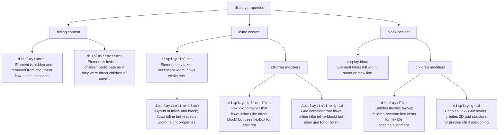

<!-- 

table	Element behaves like <table>; useful for tabular layouts.
table-row	Element behaves like <tr>; must be inside display: table.
table-cell	Element behaves like <td>; must be inside display: table-row.

list-item	Element behaves like <li>; typically includes bullets or numbers. -->