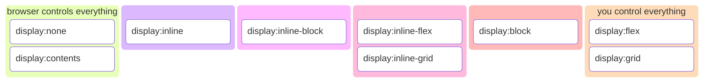
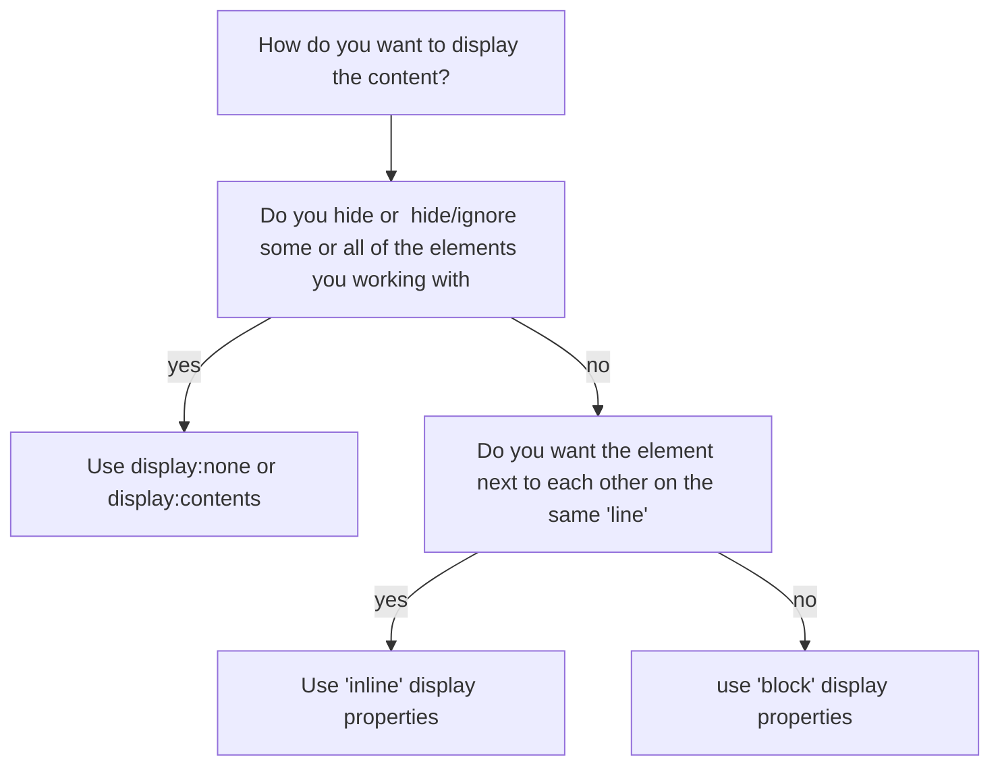
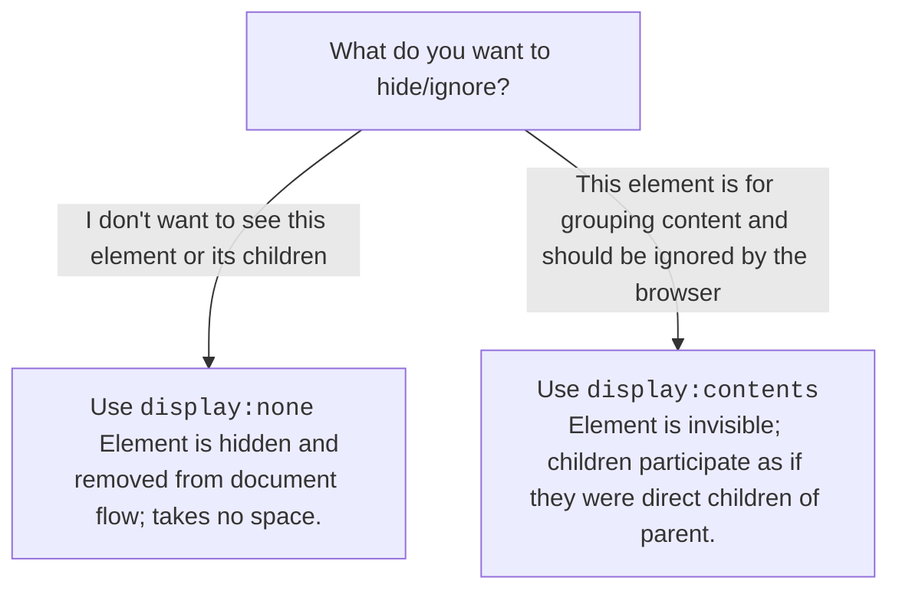
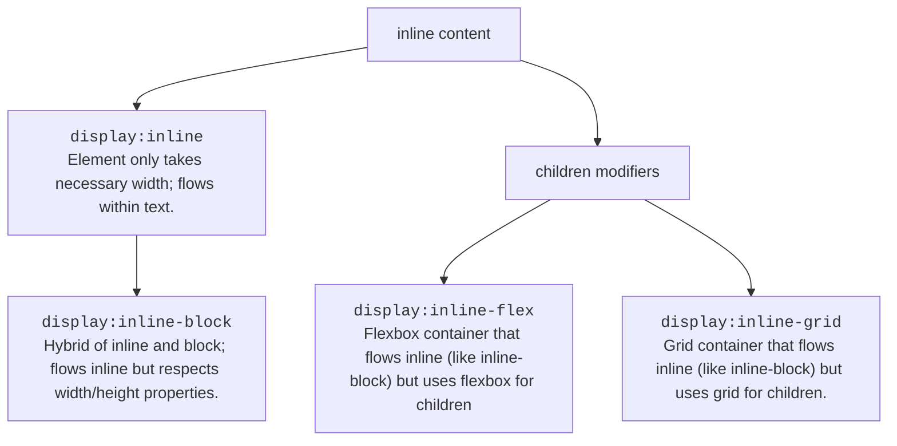
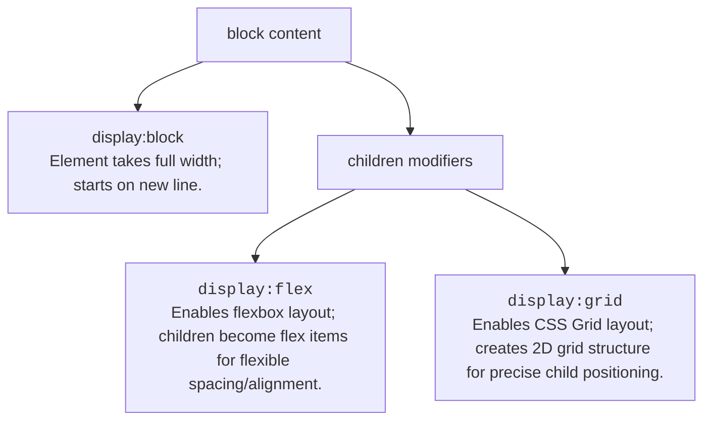

# Display Properties

CSS has severals ways to control the display of elements. 

## What do you want to do with content? 

## Hide or Ignore Elements

>[!WARNING]
> Don not set Interactive elements like inputs, buttons, or links to `display:contents` because they will will not be able to be used by your users.

## Inline Elements

## Block Elements

