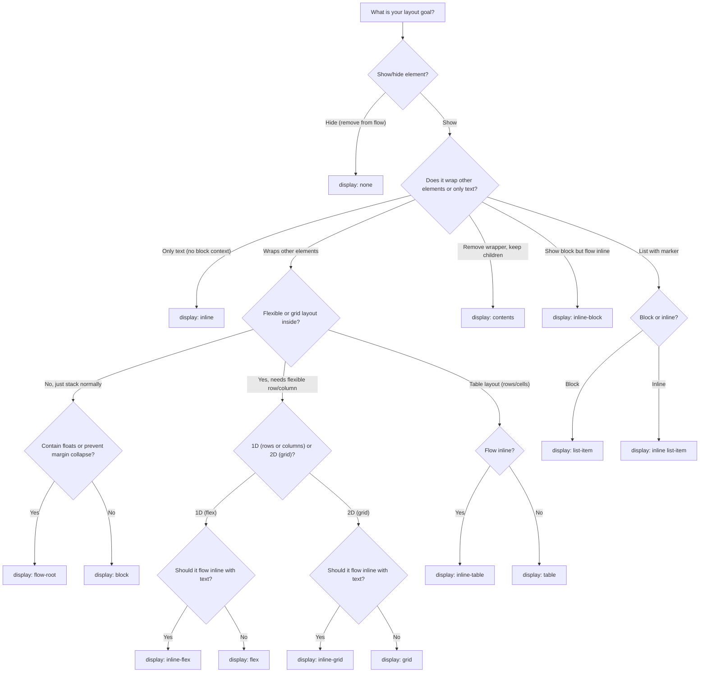

# CSS Display Properties

CSS has several ways to control the display of elements. The `display` property determines how an element is rendered and how it interacts with other elements in the document flow.

## CSS Properties by Display Type

How common CSS properties behave when different `display` values are applied. Behavior can change significantly between display types.

**Key:** ✅ property applies for this display type · ❌ property has no effect for this display type


| CSS Property                                           | `none` | `contents`                     | `block`                          | `flow-root`                        | `inline`                    | `inline-block`         | `list-item`    | `inline list-item`          | `flex`                 | `inline-flex`                         | `grid`                 | `inline-grid`                         | `table`                  | `inline-table`         |
| ------------------------------------------------------ | ------ | ------------------------------ | -------------------------------- | ---------------------------------- | --------------------------- | ---------------------- | -------------- | --------------------------- | ---------------------- | ------------------------------------- | ---------------------- | ------------------------------------- | ------------------------ | ---------------------- |
| `**width`**                                            | N/A    | No box                         | ✅; default full width            | ✅ (like block)                     | ❌                           | ✅                      | ✅ (like block) | Content-based               | ✅                      | ✅ (like flex, container inline-sized) | ✅                      | ✅ (like grid, container inline-sized) | ✅ (table layout)         | ✅; flows inline        |
| `**height**`                                           | N/A    | No box                         | ✅                                | ✅ (like block)                     | ❌                           | ✅                      | ✅ (like block) | ❌                           | ✅                      | ✅ (like flex)                         | ✅                      | ✅ (like grid)                         | ✅                        | ✅                      |
| `**min/max-width**`                                    | N/A    | No box                         | ✅                                | ✅ (like block)                     | ❌                           | ✅                      | ✅ (like block) | ❌                           | ✅                      | ✅ (like flex)                         | ✅                      | ✅ (like grid)                         | ✅                        | ✅                      |
| `**min/max-height**`                                   | N/A    | No box                         | ✅                                | ✅ (like block)                     | ❌                           | ✅                      | ✅ (like block) | ❌                           | ✅                      | ✅ (like flex)                         | ✅                      | ✅ (like grid)                         | ✅                        | ✅                      |
| `**margin` (all)**                                     | N/A    | No box                         | ✅                                | ✅; BFC (no collapse with children) | Vertical ignored            | ✅                      | ✅ (like block) | Vertical ignored            | ✅                      | ✅ (like flex)                         | ✅                      | ✅ (like grid)                         | ✅                        | ✅                      |
| `**margin: auto`**                                     | N/A    | No box                         | Horizontal center when width set | ✅ (like block)                     | ❌                           | Can center             | ✅ (like block) | ❌                           | Consumes space (flex)  | ✅ (like flex)                         | Consumes space in area | ✅ (like grid)                         | ✅                        | ✅                      |
| `**padding` (all)**                                    | N/A    | No box (children not affected) | ✅                                | ✅ (like block)                     | Vertical = no layout impact | ✅                      | ✅ (like block) | Vertical = no layout impact | ✅                      | ✅ (like flex)                         | ✅                      | ✅ (like grid)                         | ✅                        | ✅                      |
| `**vertical-align`**                                   | N/A    | N/A                            | ❌                                | ❌                                  | ✅ (baseline/line)           | ✅                      | ❌              | ✅                           | ❌                      | ❌                                     | ❌                      | ❌                                     | ✅ (cell alignment)       | ✅                      |
| `**text-align**`                                       | N/A    | N/A                            | Aligns content inside            | ✅ (like block)                     | Parent controls             | Parent controls        | ✅ (like block) | Parent controls             | ❌ on layout            | ✅ (like flex)                         | ❌ on layout            | ✅ (like grid)                         | Cell content             | Cell content           |
| `**line-height**`                                      | N/A    | N/A                            | Affects text inside              | ✅ (like block)                     | Affects line box            | Affects text/line box  | ✅ (like block) | Affects line box            | Affects text in items  | ✅ (like flex)                         | Affects text in areas  | ✅ (like grid)                         | Affects text in cells    | ✅ (like table)         |
| `**top` / `right` / `bottom` / `left**`                | N/A    | No box                         | When position ≠ static           | ✅ (like block)                     | When position ≠ static      | When position ≠ static | ✅ (like block) | When position ≠ static      | When position ≠ static | ✅ (like flex)                         | When position ≠ static | ✅ (like grid)                         | When position ≠ static   | When position ≠ static |
| `**float**`                                            | N/A    | N/A                            | ✅                                | ✅; contains floats (BFC)           | Converts to block           | ✅                      | ✅ (like block) | Converts to block           | ❌                      | ❌                                     | ❌                      | ❌                                     | ✅                        | ✅                      |
| `**clear**`                                            | N/A    | N/A                            | ✅                                | ✅                                  | ❌                           | ✅                      | ✅ (like block) | ❌                           | ❌                      | ❌                                     | ❌                      | ❌                                     | ✅                        | ✅                      |
| `**flex-***`                                           | N/A    | N/A                            | ❌                                | ❌                                  | ❌                           | ❌                      | ❌              | ❌                           | ✅ to flex items        | ✅ (like flex)                         | ❌                      | ❌                                     | ❌                        | ❌                      |
| `**grid-***`                                           | N/A    | N/A                            | ❌                                | ❌                                  | ❌                           | ❌                      | ❌              | ❌                           | ❌                      | ❌                                     | ✅ to grid items        | ✅ (like grid)                         | ❌                        | ❌                      |
| `**table-***` (e.g. `border-collapse`, `table-layout`) | N/A    | N/A                            | ❌                                | ❌                                  | ❌                           | ❌                      | ❌              | ❌                           | ❌                      | ❌                                     | ❌                      | ❌                                     | ✅                        | ✅                      |
| `**list-style-***`                                     | N/A    | N/A                            | ❌                                | ❌                                  | ❌                           | ❌                      | ✅ (marker)     | ✅ (marker)                  | ❌                      | ❌                                     | ❌                      | ❌                                     | ❌                        | ❌                      |
| `**gap**`                                              | N/A    | N/A                            | N/A                              | N/A                                | N/A                         | N/A                    | N/A            | N/A                         | ✅                      | ✅ (like flex)                         | ✅                      | ✅ (like grid)                         | N/A (use border-spacing) | N/A                    |
| `**overflow**`                                         | N/A    | N/A                            | ✅                                | ✅; creates BFC                     | Can clip inline box         | ✅                      | ✅ (like block) | Can clip                    | ✅ to container         | ✅ (like flex)                         | ✅ to container         | ✅ (like grid)                         | ✅                        | ✅                      |
| `**transform**`                                        | N/A    | N/A                            | ✅                                | ✅                                  | ✅                           | ✅                      | ✅              | ✅                           | ✅                      | ✅                                     | ✅                      | ✅                                     | ✅                        | ✅                      |


## Notes

- `**none`:** Element not rendered; no box. All layout/sizing properties are irrelevant.
- `**contents`:** Element’s box is removed; children take its place in the parent. Sizing, margin, and padding on the element don’t create a box (no layout effect). Avoid on focusable/interactive elements.
- `**block`:** Full-width by default; width/height and all margins/padding participate in layout.
- `**flow-root`:** Like block but establishes a new block formatting context (BFC): contains floats, margin doesn’t collapse with in-flow children.
- `**inline`:** Vertical margin/padding don’t affect line layout (they are painted and can overlap adjacent lines; line height is unchanged). Width/height ignored. Flows with text.
- `**inline-block`:** Inline for outer flow; accepts block-like width/height and full margin/padding.
- `**list-item`:** Block-level plus list marker; `list-style-`* and `::marker` apply.
- `**inline list-item`:** Inline flow with list marker; vertical margin/padding/width/height behave like `inline`.
- `**flex` / `inline-flex`:** Flex layout; `inline-flex` makes the container size to content inline. Float/clear ignored. Flex properties apply to flex items.
- `**grid` / `inline-grid`:** Grid layout; `inline-grid` makes the container size to content inline. Grid properties apply to grid items.
- `**table` / `inline-table`:** Table layout; `table-`* and cell display (e.g. `table-cell`) apply. `inline-table` flows inline; use `border-spacing` for cell spacing (no `gap`).

## Flowchart: How to Pick a `display` Property




**How to use:**  

- Start at the top and answer each question to choose the correct `display` property for your CSS.
- Refer to the options for specialized needs such as hiding, container removal, grid, or flex layouts.

## Display Values at a Glance

Summary of each `display` value: how the element participates in layout (external), how it lays out its children (internal), whether width/height and margin/padding apply, and when to use it.

| Display Value      | External Layout               | Internal Layout | Width/Height | Margin/Padding  | Use Case                              |
| ------------------ | ----------------------------- | --------------- | ------------ | --------------- | ------------------------------------- |
| `none`             | Removed from flow             | N/A             | N/A          | N/A             | Hide elements completely              |
| `contents`         | Removed (children take place) | N/A             | N/A          | N/A             | Grouping without wrapper              |
| `inline`           | Flows with text               | Content-based   | No           | Horizontal only | Text-like elements                    |
| `inline-block`     | Flows with text               | Content-based   | Yes          | Yes             | Inline with block features            |
| `inline list-item` | Flows with text               | List + marker   | No           | Horizontal only | Inline list with marker               |
| `inline-flex`      | Flows with text               | Flexbox         | Yes          | Yes             | Inline flex container                 |
| `inline-grid`      | Flows with text               | Grid            | Yes          | Yes             | Inline grid container                 |
| `inline-table`     | Flows with text               | Table layout    | Yes          | Yes             | Inline table                          |
| `block`            | Full width, new line          | Content-based   | Yes          | Yes             | Structural elements                   |
| `flow-root`        | Full width, new line          | Block (BFC)     | Yes          | Yes             | Containing floats, no margin collapse |
| `list-item`        | Full width, new line          | List + marker   | Yes          | Yes             | Lists with markers                    |
| `flex`             | Full width, new line          | Flexbox         | Yes          | Yes             | Flexible layouts                      |
| `grid`             | Full width, new line          | Grid            | Yes          | Yes             | 2D grid layouts                       |
| `table`            | Full width, new line          | Table layout    | Yes          | Yes             | Table layout, cell alignment          |


---

## Detailed Examples

### `display: none`

Completely removes the element from the document flow. The element takes no space and is not rendered.

**Properties:**

- Element is not rendered
- Takes no space in layout
- Not accessible to screen readers (when hidden)
- Can be toggled with JavaScript

**Example:**

```html
<div class="hidden">This is hidden</div>
<div>This appears normally</div>
```

```css
.hidden {
  display: none;
}
```

**Use cases:**

- Toggle visibility with JavaScript
- Hide elements conditionally
- Remove elements from layout calculations

---

### `display: contents`

The element's box is removed, and its children are rendered as if they were direct children of the element's parent.

**Properties:**

- Element's box is invisible
- Children participate in parent's layout
- Useful for semantic grouping without layout impact
> [!WARNING]
> Don't use on interactive elements (buttons, links, inputs).

**Example:**

```html
<div class="wrapper">
  <div class="contents-wrapper">
    <div class="item">Item 1</div>
    <div class="item">Item 2</div>
  </div>
</div>
```

```css
.wrapper {
  display: flex;
  gap: 1rem;
}

.contents-wrapper {
  display: contents; /* Items 1 and 2 become direct flex children of .wrapper */
}

.item {
  padding: 1rem;
  background: lightblue;
}
```

**Use cases:**

- Semantic HTML without layout wrapper
- CSS Grid/Flexbox where wrapper would interfere
- Grouping elements for JavaScript without layout impact

---

### `display: inline`

Element flows with text content. Only takes up as much width as needed.

**Properties:**

- Width/height have no effect
- Vertical margins/padding don't affect line layout (they are painted and can overlap adjacent lines; line height is unchanged)
- Horizontal margins/padding work
- Flows with text content
- Cannot contain block-level elements

**Example:**

```html
<p>This is a paragraph with <span class="highlight">highlighted text</span> that flows inline.</p>
```

```css
.highlight {
  display: inline;
  background-color: yellow;
  padding: 2px 4px; /* Only horizontal padding affects layout; vertical is painted but doesn't change line height */
  margin: 0 5px; /* Only horizontal margin affects layout */
  /* width: 100px; */ /* Has no effect */
  /* height: 50px; */ /* Has no effect */
}
```

**Use cases:**

- Styling text spans
- Emphasizing inline content
- Default for `<span>`, `<a>`, `<em>`, `<strong>`

---

### `display: inline-block`

Hybrid: flows inline like text but respects width, height, and all margins/padding.

**Properties:**

- Flows inline (sits next to other elements)
- Width and height work
- All margins and padding work
- Can contain block-level elements
- Respects vertical alignment

**Example:**

```html
<div class="container">
  <div class="box">Box 1</div>
  <div class="box">Box 2</div>
  <div class="box">Box 3</div>
</div>
```

```css
.container {
  text-align: center; /* Centers inline-block elements */
}

.box {
  display: inline-block;
  width: 150px;
  height: 100px;
  margin: 10px;
  padding: 20px;
  background: lightcoral;
  vertical-align: top; /* Aligns boxes at top */
}
```

**Use cases:**

- Navigation items that need specific dimensions
- Buttons with fixed sizes in a row
- Image galleries
- Elements that need to sit side-by-side with dimensions

---

### `display: list-item`

Block-level element that also shows a list marker. Use when you need a marker on a non-`<li>` element or custom list styling with `list-style-`* and `::marker`.

**Properties:**

- Behaves like block for layout
- Generates a marker box; `list-style-type`, `list-style-position`, `::marker` apply

**Example:**

```html
<div class="custom-list">
  <div class="custom-item">First</div>
  <div class="custom-item">Second</div>
</div>
```

```css
.custom-list {
  padding-left: 2rem;
}

.custom-item {
  display: list-item;
  list-style-type: disc;
}

.custom-item::marker {
  color: blue;
}
```

**Use cases:**

- Custom list styling on non-`<li>` elements
- Styling markers with `::marker`

---

### `display: inline-flex`

Flexbox container that flows inline (like inline-block) but uses flexbox for its children.

**Properties:**

- Container flows inline
- Children are flex items
- Container respects width/height
- All flexbox properties work on container

**Example:**

```html
<div class="inline-flex-container">
  <div class="flex-item">1</div>
  <div class="flex-item">2</div>
  <div class="flex-item">3</div>
</div>
<span>Text flows after the flex container</span>
```

```css
.inline-flex-container {
  display: inline-flex;
  gap: 10px;
  padding: 10px;
  background: lightgreen;
  /* Container itself flows inline */
}

.flex-item {
  padding: 10px;
  background: white;
  /* These are flex items */
}
```

**Use cases:**

- Icon groups that need flexbox alignment
- Inline navigation with flex spacing
- Tags/badges with flex alignment

---

### `display: inline-grid`

Grid container that flows inline (like inline-block) but uses CSS Grid for its children.

**Properties:**

- Container flows inline
- Children are grid items
- Container respects width/height
- All grid properties work on container

**Example:**

```html
<div class="inline-grid-container">
  <div class="grid-item">A</div>
  <div class="grid-item">B</div>
  <div class="grid-item">C</div>
  <div class="grid-item">D</div>
</div>
<span>Text continues inline</span>
```

```css
.inline-grid-container {
  display: inline-grid;
  grid-template-columns: repeat(2, 50px);
  grid-template-rows: repeat(2, 50px);
  gap: 5px;
  padding: 10px;
  background: lightblue;
}

.grid-item {
  background: white;
  display: flex;
  align-items: center;
  justify-content: center;
}
```

**Use cases:**

- Inline icon grids
- Small inline data tables
- Inline card layouts

---

### `display: block`

Element takes full width and starts on a new line.

**Properties:**

- Takes full available width
- Starts on new line
- Width and height work
- All margins and padding work
- Can contain other block and inline elements

**Example:**

```html
<div class="block-element">Block 1</div>
<div class="block-element">Block 2</div>
<span>Inline text</span>
```

```css
.block-element {
  display: block;
  width: 300px;
  height: 100px;
  margin: 20px auto; /* Centered with auto margins */
  padding: 20px;
  background: lightsteelblue;
}
```

**Use cases:**

- Structural containers (`<div>`, `<section>`, `<article>`)
- Headings (`<h1>`-`<h6>`)
- Paragraphs (`<p>`)
- Lists (`<ul>`, `<ol>`)

---

### `display: flow-root`

Like block but establishes a new block formatting context (BFC). Use instead of `overflow: hidden` when you need to contain floats or prevent margin collapse without clipping content.

**Properties:**

- Same as block; creates a BFC
- Contains floated descendants
- Margins do not collapse with in-flow children

**Example:**

```html
<div class="flow-root-container">
  <div class="float-left">Floated</div>
  <p>Content no longer wraps under the float; container contains it.</p>
</div>
```

```css
.flow-root-container {
  display: flow-root; /* Contains floats without overflow: hidden */
}

.float-left {
  float: left;
  width: 120px;
  margin-right: 1rem;
}
```

**Use cases:**

- Containing floats (modern clearfix)
- Preventing margin collapse with children
- When you need a BFC without clipping (prefer over `overflow: hidden`)

---

### `display: flex`

Flexbox container. Children become flex items arranged in a row or column.

**Properties:**

- Container is block-level
- Children become flex items
- Enables flexible layouts
- Controls alignment, spacing, and direction

**Example:**

```html
<div class="flex-container">
  <div class="flex-item">Item 1</div>
  <div class="flex-item">Item 2</div>
  <div class="flex-item">Item 3</div>
</div>
```

```css
.flex-container {
  display: flex;
  justify-content: space-between; /* Horizontal alignment */
  align-items: center; /* Vertical alignment */
  gap: 20px;
  padding: 20px;
  background: lightyellow;
}

.flex-item {
  flex: 1; /* Grow to fill available space */
  padding: 15px;
  background: white;
  text-align: center;
}
```

**Common Flexbox Properties:**

- `flex-direction`: `row` | `column` | `row-reverse` | `column-reverse`
- `justify-content`: `flex-start` | `flex-end` | `center` | `space-between` | `space-around` | `space-evenly`
- `align-items`: `flex-start` | `flex-end` | `center` | `stretch` | `baseline`
- `flex-wrap`: `nowrap` | `wrap` | `wrap-reverse`
- `gap`: Spacing between items

**Use cases:**

- Navigation bars
- Card layouts
- Centering content
- Responsive layouts
- Equal-height columns

---

### `display: grid`

CSS Grid container. Creates a 2D grid layout for precise positioning.

**Properties:**

- Container is block-level
- Children become grid items
- Enables 2D layouts (rows and columns)
- Precise control over item placement

**Example:**

```html
<div class="grid-container">
  <div class="grid-item header">Header</div>
  <div class="grid-item sidebar">Sidebar</div>
  <div class="grid-item main">Main Content</div>
  <div class="grid-item footer">Footer</div>
</div>
```

```css
.grid-container {
  display: grid;
  grid-template-columns: 200px 1fr; /* Two columns: fixed and flexible */
  grid-template-rows: auto 1fr auto; /* Three rows */
  gap: 20px;
  height: 100vh;
  padding: 20px;
  background: lightgray;
}

.grid-item {
  padding: 20px;
  background: white;
}

.header {
  grid-column: 1 / -1; /* Spans all columns */
}

.sidebar {
  grid-row: 2;
}

.main {
  grid-column: 2;
  grid-row: 2;
}

.footer {
  grid-column: 1 / -1; /* Spans all columns */
}
```

**Common Grid Properties:**

- `grid-template-columns`: Define column sizes
- `grid-template-rows`: Define row sizes
- `grid-template-areas`: Named grid areas
- `gap`: Spacing between grid items
- `grid-column` / `grid-row`: Item placement
- `justify-items` / `align-items`: Item alignment

**Use cases:**

- Complex page layouts
- Card grids
- Dashboard layouts
- Responsive image galleries
- Form layouts

---

### `display: table` / `display: inline-table`

Table layout without using `<table>`: use `display: table`, `table-row`, `table-cell` (and optionally `table-caption`) with `table-`* properties. Use `border-spacing` for cell spacing (no `gap`). `inline-table` makes the table flow inline.

**Example:**

```html
<div class="table-wrapper">
  <div class="table-row">
    <div class="table-cell">A</div>
    <div class="table-cell">B</div>
  </div>
  <div class="table-row">
    <div class="table-cell">C</div>
    <div class="table-cell">D</div>
  </div>
</div>
```

```css
.table-wrapper {
  display: table;
  border-collapse: collapse;
  border-spacing: 0; /* or e.g. 8px for gap between cells */
}

.table-row {
  display: table-row;
}

.table-cell {
  display: table-cell;
  padding: 8px;
  border: 1px solid #ccc;
}
```

**Use cases:**

- Legacy alignment (e.g. vertical-align in cells) without HTML tables
- Semantic table-like layout with divs
- Use `inline-table` when the table should flow with text

---

## Common Patterns

### Containing Floats (Clearfix)

```css
/* Modern clearfix: use flow-root to contain floats without clipping */
.clearfix {
  display: flow-root;
}

/* Alternative: overflow creates BFC but can clip content */
.clearfix-overflow {
  overflow: hidden;
}
```

### Centering Content

```css
/* Center block element */
.center-block {
  display: block;
  width: 300px;
  margin: 0 auto;
}

/* Center with flexbox */
.center-flex {
  display: flex;
  justify-content: center;
  align-items: center;
  height: 100vh;
}

/* Center with grid */
.center-grid {
  display: grid;
  place-items: center;
  height: 100vh;
}
```

### Responsive Navigation

```css
.nav {
  display: flex;
  justify-content: space-between;
  align-items: center;
}

.nav-item {
  display: inline-block;
  padding: 10px 20px;
}

@media (max-width: 768px) {
  .nav {
    flex-direction: column;
  }
}
```

### Card Grid Layout

```css
.card-container {
  display: grid;
  grid-template-columns: repeat(auto-fill, minmax(250px, 1fr));
  gap: 20px;
}

.card {
  display: flex;
  flex-direction: column;
  padding: 20px;
  background: white;
  border-radius: 8px;
}
```

---

## Tips & Best Practices

1. **Start with semantic HTML** - Use appropriate elements, then adjust display as needed
2. **Use `flex` for 1D layouts** - When arranging items in a row or column
3. **Use `grid` for 2D layouts** - When you need both row and column control
4. **Use `display: flow-root` for BFC needs** - Prefer over `overflow: hidden` when you need to contain floats or prevent margin collapse without clipping content
5. **Avoid `display: contents` on interactive elements** - It breaks accessibility
6. `**inline-block` for horizontal lists** - When you need items side-by-side with dimensions
7. `**display: none` vs `visibility: hidden`** - `none` removes from flow, `hidden` keeps space
8. **Reset display when needed** - Use `display: revert` or `display: unset` to restore inherited or initial display
9. **Test responsive behavior** - Different displays behave differently on mobile

