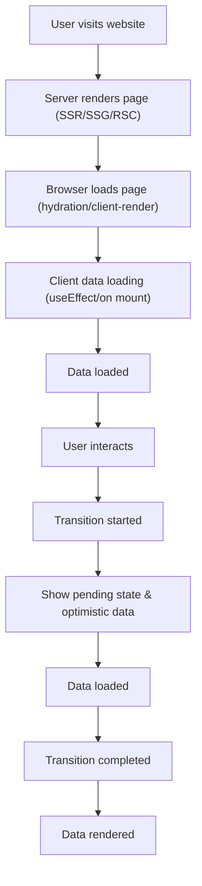
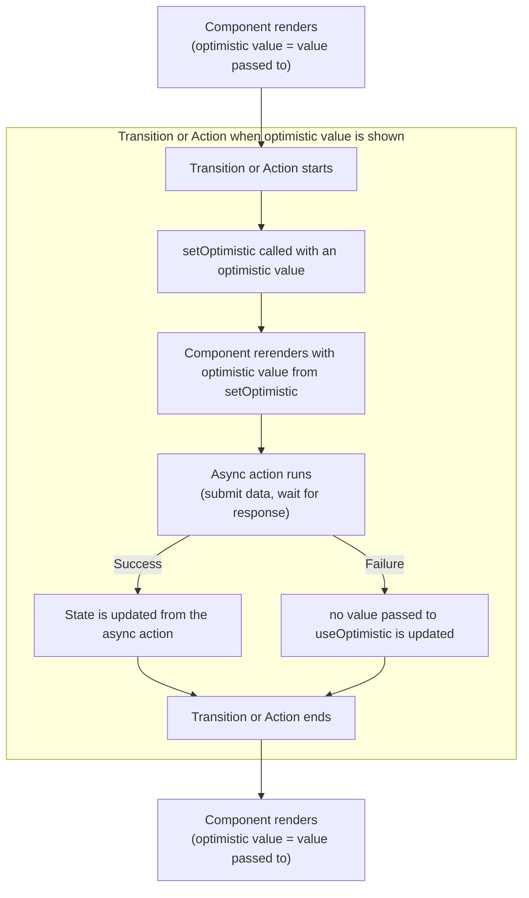
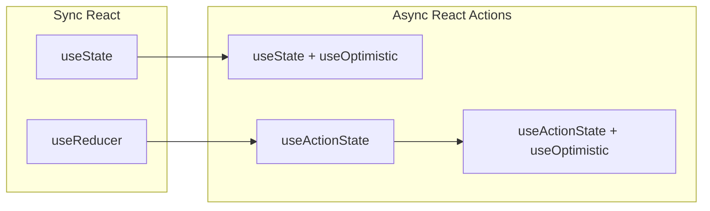

# Async React

Async React is a set of new features to help with providing performant user experiences by enabling concurrent rendering, streaming, and better data fetching patterns.



## Key Concepts

### Suspense Component
- Declarative way to handle loading states
- Shows fallback UI while data loads
- Works with both client and server components

### useTransition Hook
- Marks state updates as non-urgent transitions
- Returns `[isPending, startTransition]`
- Keeps UI responsive during updates

### useOptimistic Hook
- Shows optimistic UI updates before server confirms the action
- Returns `[optimisticState, addOptimisticUpdate]`
- Automatically reverts if the action fails
- Perfect for instant feedback on user actions like likes, comments, form submissions
- Must be called within a transition (useTransition or useActionState)

## Full Item Loading

1) Create a loading function that returns a promise. 
2) Wrap the function in a caching function (like the one below) because React requires a stable promise between reloads or you will have lots of pain with multiple requests and rerenders

```ts
const cacheFn = <Fn extends (...args: never[]) => unknown>(fn: Fn) => {
    // do not cache on server
    if (!globalThis.window) {
        return fn
    }
    const cacheMap = new Map<string, ReturnType<Fn>>();
    return (...args: Parameters<Fn>): ReturnType<Fn> =>  {
        const key = JSON.stringify(args);
        if (cacheMap.has(key)) {
            return cacheMap.get(key) as ReturnType<Fn>
        }
        const r = fn(...args) as ReturnType<Fn>;
        cacheMap.set(key, r)
        return r;
    }
};

```

3) In the parent component, use Suspense to handle loading:

```tsx
// Parent component
function ItemList() {
  return (
    <Suspense fallback={<Loading />}>
      <ItemDetails id={123} />
    </Suspense>
  );
}

// Child component that loads data (RSC)
async function ItemDetails({ id }: { id: number }) {
  const item = await fetchItem(id); // This can throw a promise
  return <div>{item.name}</div>;
}
```

4) For client-side data fetching with Suspense:

```tsx
import { use, Suspense } from 'react';

function ItemDetails({ itemPromise }: { itemPromise: Promise<Item> }) {
  const item = use(itemPromise); // use() hook reads promises
  return <div>{item.name}</div>;
}

function ItemList() {
  // Note: fetchItem must return a stable promise (use cacheFn wrapper)
  const itemPromise = fetchItem(123);
  return (
    <Suspense fallback={<Loading />}>
      <ItemDetails itemPromise={itemPromise} />
    </Suspense>
  );
}
```

## Updating Items

### Using useTransition for Updates

```tsx
import { useTransition, useState } from 'react';

function ItemEditor({ itemId }: { itemId: number }) {
  const [isPending, startTransition] = useTransition();
  const [item, setItem] = useState(null);

  const handleUpdate = async (newData: ItemData) => {
    startTransition(async () => {
      // This update is marked as a transition
      const updated = await updateItem(itemId, newData);
      setItem(updated);
    });
  };

  return (
    <div>
      {isPending && <Spinner />}
      <ItemForm item={item} onSubmit={handleUpdate} />
    </div>
  );
}
```

### Optimistic Updates with useOptimistic




```tsx
import { useOptimistic, useTransition } from 'react';

function ItemList({ items }: { items: Item[] }) {
  const [optimisticItems, addOptimisticItem] = useOptimistic(
    items,
    (state, newItem: Item) => [...state, newItem]
  );
  const [isPending, startTransition] = useTransition();

  const handleAdd = async (item: Item) => {
    startTransition(async () => {
      // Immediately show the new item (this must be done in startTransition)
      addOptimisticItem(item);
      // Actually save to server
      await saveItem(item);
    });
  };

  return (
    <div>
      {optimisticItems.map(item => (
        <Item key={item.id} item={item} />
      ))}
      {isPending && <SavingIndicator />}
    </div>
  );
}
```

### Using useActionState (formerly useFormState) for Forms

```tsx
import { useActionState } from 'react';

async function updateItemAction(
  prevState: { error?: string },
  formData: FormData
) {
  try {
    await updateItem(formData);
    return { success: true };
  } catch (error) {
    return { error: error.message };
  }
}

function ItemForm({ itemId }: { itemId: number }) {
  const [state, formAction, isPending] = useActionState(
    updateItemAction,
    null
  );

  return (
    <form action={formAction}>
      <input name="name" />
      {state?.error && <p>Error: {state.error}</p>}
      <button disabled={isPending}>
        {isPending ? 'Saving...' : 'Save'}
      </button>
    </form>
  );
}
```

## When to Use Transitions

### ✅ Use Transitions For:

**1. Non-urgent UI updates** - Updates that don't need immediate visual feedback

```tsx
// ✅ Good: Tab switching is non-urgent
function Tabs() {
  const [isPending, startTransition] = useTransition();
  const [activeTab, setActiveTab] = useState('home');

  const handleTabChange = (tab: string) => {
    startTransition(() => {
      setActiveTab(tab); // Can be deferred
    });
  };

  return (
    <div>
      {isPending && <Spinner />}
      <TabButton onClick={() => handleTabChange('home')}>Home</TabButton>
      <TabButton onClick={() => handleTabChange('about')}>About</TabButton>
    </div>
  );
}
```

**2. Filtering and searching** - When user input triggers expensive renders

```tsx
// ✅ Good: Search results can be deferred
function SearchPage() {
  const [isPending, startTransition] = useTransition();
  const [query, setQuery] = useState('');
  const [filteredResults, setFilteredResults] = useState([]);

  const handleSearch = (newQuery: string) => {
    setQuery(newQuery); // Update input immediately (urgent)
    
    startTransition(() => {
      // Filtering can be deferred
      const results = expensiveFilter(newQuery);
      setFilteredResults(results);
    });
  };

  return (
    <div>
      <input value={query} onChange={(e) => handleSearch(e.target.value)} />
      {isPending && <div>Searching...</div>}
      <ResultsList results={filteredResults} />
    </div>
  );
}
```

**3. Optimistic updates** - When showing immediate feedback before server confirmation

```tsx
// ✅ Good: Like button with optimistic update
function LikeButton({ postId, isLiked }: { postId: number; isLiked: boolean }) {
  const [isPending, startTransition] = useTransition();
  const [liked, setLiked] = useOptimistic(isLiked);

  const handleLike = () => {
    startTransition(async () => {
      setLiked(true); // Show immediately
      await likePost(postId); // Then confirm with server
    });
  };

  return (
    <button onClick={handleLike} disabled={isPending}>
      {liked ? '❤️' : '🤍'}
    </button>
  );
}
```

**4. Navigation between views** - When switching between different sections

```tsx
// ✅ Good: Page navigation
function App() {
  const [isPending, startTransition] = useTransition();
  const [page, setPage] = useState('home');

  const navigate = (newPage: string) => {
    startTransition(() => {
      setPage(newPage);
    });
  };

  return (
    <div>
      {isPending && <NavigationLoader />}
      {page === 'home' && <HomePage />}
      {page === 'about' && <AboutPage />}
    </div>
  );
}
```

### ❌ Don't Use Transitions For:

**1. Input field updates** - Text inputs must update synchronously

```tsx
// ❌ Bad: Input value updates must be immediate
function SearchInput() {
  const [isPending, startTransition] = useTransition();
  const [value, setValue] = useState('');

  const handleChange = (e: React.ChangeEvent<HTMLInputElement>) => {
    startTransition(() => {
      setValue(e.target.value); // ❌ Input will lag!
    });
  };

  // ✅ Good: Separate urgent and non-urgent updates
  const handleChange = (e: React.ChangeEvent<HTMLInputElement>) => {
    const newValue = e.target.value;
    setValue(newValue); // Immediate (urgent)
    
    startTransition(() => {
      // Only defer the expensive filtering
      setFilteredResults(filter(newValue));
    });
  };
}
```

**2. Form validation** - Validation feedback should be immediate

```tsx
// ❌ Bad: Validation should be instant
function EmailInput() {
  const [isPending, startTransition] = useTransition();
  const [email, setEmail] = useState('');
  const [error, setError] = useState('');

  const handleChange = (e: React.ChangeEvent<HTMLInputElement>) => {
    startTransition(() => {
      setEmail(e.target.value);
      setError(validateEmail(e.target.value)); // ❌ Delayed feedback!
    });
  };

  // ✅ Good: Immediate validation
  const handleChange = (e: React.ChangeEvent<HTMLInputElement>) => {
    const newEmail = e.target.value;
    setEmail(newEmail); // Immediate
    setError(validateEmail(newEmail)); // Immediate
  };
}
```

**3. Critical state changes** - State that affects user's ability to interact

```tsx
// ❌ Bad: Modal visibility should be immediate
function Modal() {
  const [isPending, startTransition] = useTransition();
  const [isOpen, setIsOpen] = useState(false);

  const openModal = () => {
    startTransition(() => {
      setIsOpen(true); // ❌ Modal will appear delayed!
    });
  };

  // ✅ Good: Immediate modal state
  const openModal = () => {
    setIsOpen(true); // Immediate
    // Only defer heavy content loading
    startTransition(async () => {
      await loadModalContent();
    });
  };
}
```

### Key Principles:

1. **Urgent updates** (user input, feedback) → No transition
2. **Non-urgent updates** (filtering, navigation, optimistic updates) → Use transition
3. **Separate concerns** → Update urgent state immediately, defer expensive work
4. **User perception** → If the user expects immediate feedback, don't use a transition

## Data Fetching Patterns

### Server Component Pattern (Next.js App Router)

```tsx
// app/items/[id]/page.tsx
async function ItemPage({ params }: { params: { id: string } }) {
 // will block until fetchItem loads this delays when this function renders
  const item = await fetchItem(params.id); // Direct async/await
  
  return (
    <div>
      <h1>{item.name}</h1>
      <Suspense fallback={<CommentsLoading />}>
        <Comments itemId={item.id} />
      </Suspense>
    </div>
  );
}

async function Comments({ itemId }: { itemId: string }) {
  const comments = await fetchComments(itemId);
  return (
    <ul>
      {comments.map(comment => (
        <li key={comment.id}>{comment.text}</li>
      ))}
    </ul>
  );
}
```

### Client Component with use() Hook

```tsx
'use client';

import { use, Suspense } from 'react';

function ItemView({ itemPromise }: { itemPromise: Promise<Item> }) {
  const item = use(itemPromise); // Unwraps the promise
  
  return <div>{item.name}</div>;
}

function ItemPage() {
  // Note: fetchItem must return a stable promise (use cacheFn wrapper)
  const itemPromise = fetchItem(123);
  
  return (
    <Suspense fallback={<Loading />}>
      <ItemView itemPromise={itemPromise} />
    </Suspense>
  );
}
```

### Streaming with Suspense Boundaries

```tsx
function Dashboard() {
  return (
    <>
      <Suspense fallback={<HeaderSkeleton />}>
        <Header />
      </Suspense>
      
      <Suspense fallback={<StatsSkeleton />}>
        <Stats />
      </Suspense>
      
      <Suspense fallback={<FeedSkeleton />}>
        <Feed />
      </Suspense>
    </>
  );
}
// Each section streams independently
```

## Error Handling

### Error Boundaries with Async

```tsx
'use client';

import { ErrorBoundary } from 'react-error-boundary';

function ErrorFallback({ error, resetErrorBoundary }: { error: Error; resetErrorBoundary: () => void }) {
  return (
    <div role="alert">
      <p>Something went wrong:</p>
      <pre>{error.message}</pre>
      <button onClick={resetErrorBoundary}>Try again</button>
    </div>
  );
}

function App() {
  return (
    <ErrorBoundary FallbackComponent={ErrorFallback}>
      <Suspense fallback={<Loading />}>
        <AsyncComponent />
      </Suspense>
    </ErrorBoundary>
  );
}
```

## Performance Tips

1. **Use Suspense boundaries strategically** - Place them around independent data sections
2. **Cache promises** - Prevent duplicate requests with stable promise references
3. **Use transitions for non-urgent updates** - Keep UI responsive
4. **Optimistic updates** - Show immediate feedback while server processes
5. **Stream server components** - Send HTML as it's ready, not all at once
6. **Defer non-critical data** - Use `useDeferredValue` for search/filter inputs
7. **Parallel data fetching** - Use `Promise.all()` when data sources are independent

## Common Patterns

### Parallel Data Fetching (RSC Pattern)

```tsx
async function ItemPage({ id }: { id: string }) {
  // These fetch in parallel
  const [item, comments, related] = await Promise.all([
    fetchItem(id),
    fetchComments(id),
    fetchRelated(id)
  ]);
  
  return (
    <div>
      <ItemDetails item={item} />
      <Comments comments={comments} />
      <RelatedItems items={related} />
    </div>
  );
}
```

### Sequential Data Fetching with Loading States

```tsx
async function ItemPage({ id }: { id: string }) {
  const item = await fetchItem(id);
  
  return (
    <div>
      <ItemDetails item={item} />
      <Suspense fallback={<CommentsLoading />}>
        <Comments itemId={item.id} />
      </Suspense>
    </div>
  );
}
```

### Conditional Suspense Loading

```tsx
function ConditionalData({ shouldLoad }: { shouldLoad: boolean }) {
  if (!shouldLoad) return null;
  
  return (
    <Suspense fallback={<Loading />}>
      <DataComponent />
    </Suspense>
  );
}
```
## Sync React to Async React State Flow


