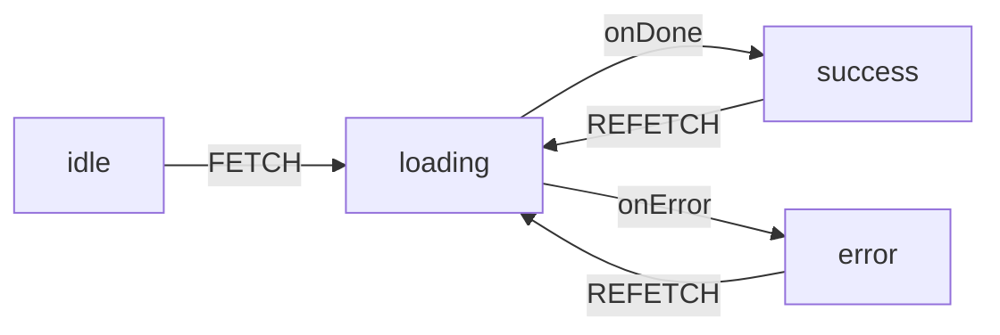

# Data fetching in React

React offers several ways to load data: client-side with `useEffect` or libraries like React Query and SWR (caching, refetching), and server-side with async Server Components or Server/Client Components using the `use()` hook for streaming and Suspense. This guide compares these approaches and when to use each.

**When to use which:** Simple one-off fetch → `useEffect`. Cached, refetchable client data → useQuery or SWR. Route-level data before render → framework loaders. Server-first, no loading UI → async Server Component. Server-first with streaming/Suspense → Server Component + `use()`. Client-side promises with Suspense → Client Component + `use()`. Explicit loading/success/error states, retry or refetch via events → XState.

## Quick comparison

| Approach              | Where it runs | Best for                                  |
|-----------------------|---------------|--------------------------------------------|
| `useEffect`           | Client        | Simple one-off fetches                     |
| useQuery / SWR        | Client        | Cached, refetchable client data            |
| XState (machine + invoke) | Client   | Explicit loading/success/error, retry/refetch via events |
| Router loaders        | Server / isomorphic | Route-level data before render (framework) |
| Async Server Component | Server       | Server loading, no Suspense                |
| Server Component + `use()` | Server → Client | Initial page data, streaming           |
| Client Component + `use()` | Client       | Client-side promises + Suspense            |


## `useEffect`

Classic client-side fetch on mount. Good for one-off or simple cases; no built-in caching or deduplication.

```tsx
'use client';

import { useEffect, useState } from 'react';

function UserProfile({ userId }: { userId: string }) {
  const [user, setUser] = useState<User | null>(null);
  const [loading, setLoading] = useState(true);
  const [error, setError] = useState<Error | null>(null);

  useEffect(() => {
    let cancelled = false;

    async function fetchUser() {
      setLoading(true);
      setError(null);
      try {
        const res = await fetch(`/api/users/${userId}`);
        if (!res.ok) throw new Error('Failed to fetch');
        const data = await res.json();
        if (!cancelled) setUser(data);
      } catch (e) {
        if (!cancelled) setError(e instanceof Error ? e : new Error('Unknown error'));
      } finally {
        if (!cancelled) setLoading(false);
      }
    }

    fetchUser();
    return () => { cancelled = true; }; // cleanup: avoid setState after unmount
  }, [userId]);

  if (loading) return <Spinner />;
  if (error) return <Error message={error.message} />;
  if (!user) return null;
  return <div>{user.name}</div>;
}
```

**Advantages**
- No extra dependencies; built into React.
- Full control over when to fetch, loading, and error handling.
- Easy to understand and debug.

**Disadvantages**
- No caching or request deduplication (same data can be fetched multiple times).
- Waterfall requests if children fetch in their own `useEffect`.
- You must handle cleanup (e.g. cancel flag) to avoid setState after unmount.
- Loading/error boilerplate repeated in every component.

---

## Data-fetching libraries (useQuery, SWR)

Libraries add caching, refetching, deduplication, and loading/error state. Prefer these over raw `useEffect` for most client-side data fetching.

### React Query (TanStack Query)

```tsx
'use client';

import { useQuery } from '@tanstack/react-query';

function UserProfile({ userId }: { userId: string }) {
  const { data: user, isLoading, error, refetch } = useQuery({
    queryKey: ['user', userId],
    queryFn: () => fetch(`/api/users/${userId}`).then((r) => r.json()),
    staleTime: 60_000, // consider data fresh for 1 min
  });

  if (isLoading) return <Spinner />;
  if (error) return <Error message={String(error)} />;
  if (!user) return null;
  return <div>{user.name}</div>;
}
```

### SWR

```tsx
'use client';

import useSWR from 'swr';

const fetcher = (url: string) => fetch(url).then((r) => r.json());

function UserProfile({ userId }: { userId: string }) {
  const { data: user, error, isLoading, mutate } = useSWR(
    `/api/users/${userId}`,
    fetcher,
    { revalidateOnFocus: false }
  );

  if (isLoading) return <Spinner />;
  if (error) return <Error message={error.message} />;
  if (!user) return null;
  return <div>{user.name}</div>;
}
```

**Advantages**
- Caching, deduplication, and configurable stale/refetch behavior.
- Built-in loading and error state; less boilerplate.
- Background refetch (e.g. on focus, interval) keeps data fresh.
- DevTools and patterns for invalidation, optimistic updates, and mutations.

**Disadvantages**
- Extra dependency and bundle size.
- Learning curve for query keys, invalidation, and options.
- Overkill for very simple or one-off fetches.

### XState

Use a **state machine** with explicit `idle` → `loading` (invoke) → `success` or `error` states. The fetch runs in an **invoked actor** (`fromPromise`); context holds the result and error. Refetch or retry by sending an event (e.g. `REFETCH`). Fits well when you want clear, debuggable states or already use XState elsewhere. See [xstate.md](xstate.md) for machine basics, `invoke`, and `useMachine`.



**Machine:** `idle` (initial; on `FETCH` → `loading`), `loading` (invoke `fetchUser` with `userId` from input; `onDone` → `success` + assign user; `onError` → `error` + assign error), `success` and `error` (on `REFETCH` → `loading`). Pass `userId` into the machine via **input** so one machine definition can be reused per user (e.g. `useMachine(machine, { input: { userId } })`).

```tsx
'use client';

import { createMachine, assign, fromPromise } from 'xstate';
import { useMachine } from '@xstate/react';

const fetchUserMachine = createMachine({
  id: 'fetchUser',
  initial: 'idle',
  context: ({ input }: { input: { userId: string } }) => ({
    userId: input.userId,
    user: null as User | null,
    error: null as Error | null,
  }),
  states: {
    idle: {
      on: { FETCH: 'loading' },
    },
    loading: {
      invoke: {
        src: 'fetchUser',
        input: ({ context }) => ({ id: context.userId }),
        onDone: { target: 'success', actions: assign({ user: ({ event }) => event.output, error: null }) },
        onError: { target: 'error', actions: assign({ error: ({ event }) => event.error }) },
      },
    },
    success: {
      on: { REFETCH: 'loading' },
    },
    error: {
      on: { REFETCH: 'loading' },
    },
  },
}).provide({
  actors: {
    fetchUser: fromPromise(async ({ input }: { input: { id: string } }) => {
      const res = await fetch(`/api/users/${input.id}`);
      if (!res.ok) throw new Error('Failed to fetch');
      return res.json();
    }),
  },
});

function UserProfile({ userId }: { userId: string }) {
  const [snapshot, send] = useMachine(fetchUserMachine, { input: { userId } });

  if (snapshot.matches('idle')) {
    return <button onClick={() => send({ type: 'FETCH' })}>Load user</button>;
  }
  if (snapshot.matches('loading')) return <Spinner />;
  if (snapshot.matches('error')) {
    return (
      <>
        <Error message={snapshot.context.error?.message ?? 'Unknown error'} />
        <button onClick={() => send({ type: 'REFETCH' })}>Retry</button>
      </>
    );
  }
  const user = snapshot.context.user;
  if (!user) return null;
  return (
    <div>
      {user.name}
      <button onClick={() => send({ type: 'REFETCH' })}>Refetch</button>
    </div>
  );
}
```

To start loading immediately (e.g. on mount), set `initial: 'loading'` and trigger the invoke from a top-level transition, or send `FETCH` in an `entry` action on a parent state. The example above uses `idle` so the user clicks to load.

**Advantages**
- Explicit states (idle, loading, success, error) are easy to reason about and debug; state charts and DevTools visualize the flow.
- Retry and refetch are just events; no ad-hoc loading flags.
- Fits apps that already use XState; same patterns for forms, wizards, and async flows.
- Input (e.g. `userId`) can be passed via `useMachine(machine, { input: { userId } })`, so one machine is reusable per resource.

**Disadvantages**
- More boilerplate than useQuery/SWR; no built-in caching or request deduplication (you can layer a cache outside the machine if needed).
- Learning curve for machines, invoke, and `assign` if the team doesn't use XState yet.

---

## Router data loaders

Many frameworks let you load data at the **route** level so it’s ready before the page component renders. The router runs a loader (or equivalent) and passes the result into the page. This avoids client waterfalls for initial data and keeps loading logic next to the route.

### TanStack Start (TanStack Router)

TanStack Start uses **loaders** (and `beforeLoad`) that run on the server for the first request and on the client for later navigations. Use `useLoaderData()` in the route component.

```tsx
import { createFileRoute } from '@tanstack/react-router';

export const Route = createFileRoute('/posts/$id')({
  loader: async ({ params }) => {
    const res = await fetch(`https://api.example.com/posts/${params.id}`);
    if (!res.ok) throw new Error('Failed to fetch');
    return res.json();
  },
  component: PostPage,
});

function PostPage() {
  const post = Route.useLoaderData();
  return (
    <article>
      <h1>{post.title}</h1>
      <p>{post.body}</p>
    </article>
  );
}
```

`beforeLoad` runs parent → child and is good for auth; `loader` runs after and is for data. Both are isomorphic (server on first load, client on navigation).

### Next.js Pages Router — `getServerSideProps`

In the Pages Router, **getServerSideProps** runs on the server on every request. It receives `context` (with `params`, `query`, `req`, `res`). Return `{ props }` and the page receives them as props.

```tsx
// pages/post/[id].tsx
export async function getServerSideProps(context) {
  const { id } = context.params;
  const res = await fetch(`https://api.example.com/posts/${id}`);
  if (!res.ok) return { notFound: true };
  const post = await res.json();
  return { props: { post } };
}

export default function PostPage({ post }: { post: Post }) {
  return (
    <article>
      <h1>{post.title}</h1>
      <p>{post.body}</p>
    </article>
  );
}
```

Use `getStaticProps` for static data at build time; `getServerSideProps` is for per-request server data.

### React Router (v6.4+ data APIs)

With the data router (e.g. `createBrowserRouter`), define a **loader** on the route. It can run on the server (SSR) or client. The page (and any child) reads the result with `useLoaderData()`.

```tsx
import { useLoaderData } from 'react-router';

export async function loader({ params }) {
  const res = await fetch(`https://api.example.com/posts/${params.id}`);
  if (!res.ok) throw new Response('Not found', { status: 404 });
  return res.json();
}

export default function PostPage() {
  const post = useLoaderData();
  return (
    <article>
      <h1>{post.title}</h1>
      <p>{post.body}</p>
    </article>
  );
}
```

React Router also supports **clientLoader** for client-only loading. Loader data is stable and safe to use in dependency arrays.

### Redwood — Cells

Redwood doesn’t use route loaders; it uses **Cells**, a component-level pattern. You put a Cell on the page and export a GraphQL `QUERY` plus `Success` (required), and optionally `Loading`, `Empty`, and `Failure`. The Cell runs the query and renders the right state. Route params are passed as props from the page to the Cell (e.g. for `$id` in the query).

```tsx
// PostCell.tsx
import type { PostQuery, PostQueryVariables } from 'types/graphql';
import type { CellSuccessProps, CellFailureProps } from '@redwoodjs/web';

export const QUERY = gql`
  query PostQuery($id: String!) {
    post(id: $id) {
      id
      title
      body
    }
  }
`;

export const Loading = () => <div>Loading…</div>;
export const Failure = ({ error }: CellFailureProps) => <div>Error: {error.message}</div>;
export const Success = ({ post }: CellSuccessProps<PostQuery>) => (
  <article>
    <h1>{post.title}</h1>
    <p>{post.body}</p>
  </article>
);
```

```tsx
// PostPage.tsx — route receives params, passes to Cell
import PostCell from 'src/components/PostCell/PostCell';

const PostPage = ({ id }: { id: string }) => <PostCell id={id} />;
export default PostPage;
```

Cells use `beforeQuery` (and `afterQuery`) to map props to query variables. Data runs client-side via the app’s GraphQL API unless you use prerender.

**Summary**

| Framework           | API                     | Where it runs        |
|---------------------|-------------------------|----------------------|
| TanStack Start      | `loader`, `beforeLoad`  | Server then client   |
| Next.js Pages       | `getServerSideProps`    | Server only          |
| React Router        | `loader`, `clientLoader`| Server or client     |
| Redwood             | Cells (`QUERY`, `Success`, `Loading`/`Failure`/`Empty`) | Client (GraphQL)     |

---

## Async Server Component

Loading data on the server with no Suspense and no client-side data loading: use a React component that is an **async function**. It runs on the server, `await`s data directly, and renders. No loading state or Suspense needed for that component’s data.

In frameworks like Next.js App Router, components in the server tree can be async. You don’t put `"use server"` on the component—that directive is for Server **Actions**, not for making a component run on the server. The component runs on the server by default.

```tsx
// Server Component (e.g. app/post/[id]/page.tsx) — async function, runs on server
async function PostPage({ params }: { params: { id: string } }) {
  const post = await getPost(params.id); // await directly, no Suspense
  return (
    <article>
      <h1>{post.title}</h1>
      <p>{post.body}</p>
    </article>
  );
}

export default PostPage;
```

```tsx
// Data access (e.g. server-only, no "use server" required for the fetch)
async function getPost(id: string) {
  const res = await fetch(`https://api.example.com/posts/${id}`);
  if (!res.ok) throw new Error('Failed to fetch');
  return res.json();
}
```

**Advantages**
- Data loads on the server; no client fetch or loading state for that data.
- No Suspense or data-loading library; just `await` in the component.
- Direct DB/API access, secrets stay server-side; good for SEO and first paint.

**Disadvantages**
- Entire component waits for data (no streaming for that tree unless you split with Suspense).
- Requires a framework that supports Server Components (e.g. Next.js App Router).
- Refetching after mutation usually needs a new request (e.g. navigation or revalidate).

---

## Server Component + `use()`

Server Components can `await` async work directly. Pass the resulting **promise** to a child that uses the `use()` hook so the child can unwrap it and Suspense can show a fallback.

```tsx
// Server Component (e.g. app/post/[id]/page.tsx)
import { Suspense } from 'react';
import { getPost } from '@/app/actions';
import { PostContent } from './PostContent';

export default async function PostPage({ params }: { params: { id: string } }) {
  const postPromise = getPost(params.id); // returns Promise<Post>
  return (
    <Suspense fallback={<PostSkeleton />}>
      <PostContent postPromise={postPromise} />
    </Suspense>
  );
}
```

```tsx
// Client or Server component that unwraps the promise
import { use } from 'react';

function PostContent({ postPromise }: { postPromise: Promise<Post> }) {
  const post = use(postPromise); // suspends until resolved
  return (
    <article>
      <h1>{post.title}</h1>
      <p>{post.body}</p>
    </article>
  );
}
```

**Advantages**
- Data fetched on the server; faster first paint and no client waterfall for initial data.
- Streaming: Suspense fallback shows while data loads, then content replaces it.
- Good for SEO and perceived performance; one round-trip for markup + data.

**Disadvantages**
- Data is for that request only (no long-lived client cache unless you refetch on client).
- Requires a framework that supports Server Components (e.g. Next.js App Router).
- Refetching after mutation usually needs `revalidatePath`/`revalidateTag` or a client refetch.

---

## Client Component + `use()`

In a Client Component, `use(promise)` lets you read a promise that was passed as a prop or created in the same tree. Wrap the component in `<Suspense>` so React can show a fallback while the promise is pending.

Use a **stable** promise (e.g. from a cache or from the same render) so React doesn’t refetch on every render.

```tsx
'use client';

import { use, Suspense } from 'react';


const cache = <T extends (...args: any[]) => any>(fn: T, maxNumber = 10): T => {
  const cacheMap = new Map<string, ReturnType<T>>();
  return ((...args: Parameters<T>): ReturnType<T> => {
    const key = JSON.stringify(args);
    if (cacheMap.has(key)) {
      const value = cacheMap.get(key)!;
      cacheMap.delete(key);
      cacheMap.set(key, value); // move to end (LRU)
      return value;
    }
    const value = fn(...args) as ReturnType<T>;
    cacheMap.set(key, value);
    if (cacheMap.size > maxNumber) {
      cacheMap.delete(cacheMap.keys().next().value);
    }
    return value;
  }) as T;
};

const fetchUser = cache(async (userId: string) => {
  const res = await fetch(`/api/users/${userId}`);
  if (!res.ok) throw new Error('Failed to fetch');
  return res.json();
});

function UserName({ userId }: { userId: string }) {
  const userPromise = fetchUser(userId); // stable: same args → same promise (cached)
  const user = use(userPromise);
  return <span>{user.name}</span>;
}

export function UserCard({ userId }: { userId: string }) {
  return (
    <Suspense fallback={<span>Loading…</span>}>
      <UserName userId={userId} />
    </Suspense>
  );
}
```

The custom `cache()` above deduplicates by arguments so the same `userId` returns the same promise and caps size with LRU eviction (`maxNumber`). Use it so the same args return a stable promise across renders. React’s built-in `cache()` is server-side only, so in Client Components you need your own cache (like this) for stable promises.

**Advantages**
- Declarative: component receives a promise and uses `use()`; Suspense handles loading.
- No `useEffect` or manual loading state; works well with React's concurrent rendering.
- Same mental model as Server Component + `use` (promise in, value out).
- Custom cache gives you control over size and eviction (e.g. LRU) on the client.

**Disadvantages**
- You must ensure a **stable** promise (e.g. via `cache()` or a cache keyed by args); otherwise every render can trigger a new request.
- Error handling must be done in an Error Boundary or inside the promise (e.g. try/catch in the fetcher); rejected promises don’t surface to the component.
- Cache is in-memory only; no persistence across full page reloads.
- Less ecosystem support than useQuery/SWR (no built-in refetch on interval, focus, or invalidation helpers).

---


