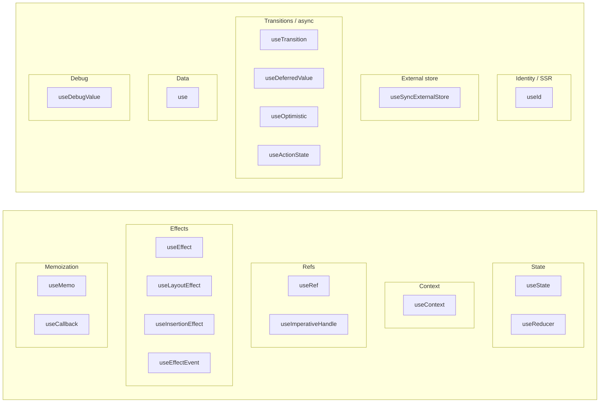

# React Hooks

Hooks let you reuse stateful logic in function components without classes. They run inside function components (or other hooks) and give you state, effects, refs, and more. This cheat sheet is a quick reference for built-in hooks and custom hooks. For a high-level map of how hooks fit with Suspense, context, and async patterns, see [React Concepts](react-concepts.md).

## Rules of Hooks

- **Top level only** — Don’t call hooks inside loops, conditions, or nested functions. Call them at the top level of your component or custom hook.
- **Only in React functions** — Call hooks only from React function components or from custom hooks (functions whose name starts with `use`).
- React relies on the **same order** of hook calls on every render to associate state with each hook; breaking that order can cause bugs.

## Built-in Hooks




### State


| Hook         | Signature                                | Purpose                                                                              |
| ------------ | ---------------------------------------- | ------------------------------------------------------------------------------------ |
| `useState`   | `useState(initialState)`                 | Holds a reactive value and setter; re-renders when the value changes.                |
| `useReducer` | `useReducer(reducer, initialArg, init?)` | State via a reducer `(state, action) => newState`; good for complex or nested state. |


```tsx
const [count, setCount] = useState(0);
const [state, dispatch] = useReducer(reducer, { count: 0 });
```

### Context


| Hook         | Signature                 | Purpose                                                             |
| ------------ | ------------------------- | ------------------------------------------------------------------- |
| `useContext` | `useContext(SomeContext)` | Reads the current value from the nearest provider for that context. |


### Refs


| Hook                  | Signature                                       | Purpose                                                                                                             |
| --------------------- | ----------------------------------------------- | ------------------------------------------------------------------------------------------------------------------- |
| `useRef`              | `useRef(initialValue)`                          | Mutable ref that persists across renders; use for DOM nodes or any mutable value that shouldn’t trigger re-renders. |
| `useImperativeHandle` | `useImperativeHandle(ref, createHandle, deps?)` | Customizes what the parent sees when it uses `ref` on a component (e.g. expose a subset of methods).                |


```tsx
const inputRef = useRef<HTMLInputElement>(null);
```

**useImperativeHandle** — expose a custom handle to the parent (use with `forwardRef`):

```tsx
const Input = forwardRef(function Input(props, ref) {
  const inputRef = useRef<HTMLInputElement>(null);
  useImperativeHandle(ref, () => ({
    focus: () => inputRef.current?.focus(),
    scrollIntoView: () => inputRef.current?.scrollIntoView(),
  }), []);
  return <input ref={inputRef} {...props} />;
});

// Parent can call ref.current.focus() or ref.current.scrollIntoView()
```

### Effects


| Hook | Signature | When it runs | Purpose |
| --- | --- | --- | --- |
| `useInsertionEffect` | `useInsertionEffect(setup, deps?)` | **Before** DOM mutations (before layout effects). Cleanup in reverse order. | For CSS-in-JS libraries that inject styles so they exist before layout runs. |
| `useLayoutEffect` | `useLayoutEffect(setup, deps?)` | After DOM updates, **before** browser paint (synchronous). Cleanup before next layout effect or unmount. | Use for measurements or DOM mutations that must be visible immediately. |
| `useEffect` | `useEffect(setup, deps?)` | After commit and **after** browser paint (async). Cleanup before next effect or unmount. | Runs side effects (e.g. fetch, subscriptions). |
| `useEffectEvent` | `useEffectEvent(handler)` | Does not run on a schedule — returns a **stable function** you call from inside an effect (or from event handlers). | Wraps *event-like logic*: code that runs in response to a trigger (e.g. user action, message) rather than because a dependency changed. Keeping it in `useEffectEvent` avoids adding it to the effect dependency array, so the effect does not re-run when that logic changes. Use the returned function inside `useEffect`. |


```tsx
useEffect(() => {
  const sub = subscribe(id);
  return () => sub.unsubscribe();
}, [id]);
```

### Memoization


| Hook          | Signature                | Purpose                                                                       |
| ------------- | ------------------------ | ----------------------------------------------------------------------------- |
| `useMemo`     | `useMemo(compute, deps)` | Memoizes the result of `compute`; recomputes only when `deps` change.         |
| `useCallback` | `useCallback(fn, deps)`  | Returns a stable function reference; equivalent to `useMemo(() => fn, deps)`. |


```tsx
const value = useMemo(() => expensive(a, b), [a, b]);
const onClick = useCallback(() => doSomething(id), [id]);
```

### Identity / SSR


| Hook    | Signature | Purpose                                                                                                         |
| ------- | --------- | --------------------------------------------------------------------------------------------------------------- |
| `useId` | `useId()` | Generates a stable unique ID that matches between server and client (e.g. for `aria-describedby`, form labels). |


### External store


| Hook                   | Signature                                                          | Purpose                                                                                 |
| ---------------------- | ------------------------------------------------------------------ | --------------------------------------------------------------------------------------- |
| `useSyncExternalStore` | `useSyncExternalStore(subscribe, getSnapshot, getServerSnapshot?)` | Subscribes to an external store in a way that’s safe with concurrent rendering and SSR. |


### Transitions / async


| Hook               | Signature                              | Purpose                                                                                                           |
| ------------------ | -------------------------------------- | ----------------------------------------------------------------------------------------------------------------- |
| `useTransition`    | `useTransition()`                      | Returns `[isPending, startTransition]`; wrap non-urgent state updates in `startTransition` to keep UI responsive. |
| `useDeferredValue` | `useDeferredValue(value)`              | Returns a deferred copy of `value` that can lag behind during heavy updates.                                      |
| `useOptimistic`    | `useOptimistic(state, updateFn?)`      | Lets you show optimistic UI that reverts if the async action fails; use inside a transition/Action.                      |
| `useActionState`   | `useActionState(action, initialState)` | Wraps an async action (e.g. form action) and provides pending state and the last result. Can be used as an async reducer: the action receives `(prevState, formData)` and returns the next state (or a promise of it). must be called inside a transition/Action |


See [Async React](async-react.md) for patterns with `useTransition`, `useOptimistic`, and form actions.

### Data


| Hook  | Signature                        | Purpose                                                                    |
| ----- | -------------------------------- | -------------------------------------------------------------------------- |
| `use` | `use(promise)` or `use(context)` | Reads a promise (with Suspense) or a context; can be called conditionally. **Note:** When used with a promise, the promise must be stable or cached between renders (e.g. via a cache wrapper) or React may re-suspend repeatedly. |


### Debug


| Hook            | Signature                       | Purpose                                                                                       |
| --------------- | ------------------------------- | --------------------------------------------------------------------------------------------- |
| `useDebugValue` | `useDebugValue(value, format?)` | Displays a label for custom hooks in React DevTools; optional formatter for expensive values. |


---

## Custom Hooks

A **custom hook** is a function whose name starts with `use` and that calls other hooks. It reuses stateful logic across components. The same Rules of Hooks apply: only call hooks at the top level inside the custom hook.

**Return patterns:** Return whatever fits the use case — e.g. `[state, setState]`, `{ value, setValue, ... }`, or a single value.

**When to create one (rules of thumb):**
- You're **repeating** the same hook(s) or state/effect logic in more than one component.
- A component is **too busy** — pull a coherent slice of state + effects into a hook and give it a clear name.
- The logic is a **distinct concern** (e.g. "sync with localStorage", "debounce this value", "subscribe to X") that you want to reuse or test in isolation.
- You want to **hide implementation details** (e.g. refs, subscriptions) behind a simple API.

### Common examples

**useLocalStorage** — Sync state with localStorage:

```tsx
function useLocalStorage<T>(key: string, initial: T): [T, (v: T) => void] {
  const [state, setState] = useState<T>(() => {
    try {
      return JSON.parse(localStorage.getItem(key) ?? '') ?? initial;
    } catch {
      return initial;
    }
  });
  useEffect(() => {
    localStorage.setItem(key, JSON.stringify(state));
  }, [key, state]);
  return [state, setState];
}
```

**useDebounce** — Debounced value for search/input:

```tsx
function useDebounce<T>(value: T, delay: number): T {
  const [debounced, setDebounced] = useState(value);
  useEffect(() => {
    const id = setTimeout(() => setDebounced(value), delay);
    return () => clearTimeout(id);
  }, [value, delay]);
  return debounced;
}
```

**usePrevious** — Previous render value:

```tsx
function usePrevious<T>(value: T): T | undefined {
  const ref = useRef<T>();
  useEffect(() => {
    ref.current = value;
  });
  return ref.current;
}
```

**useOnClickOutside** — Click-outside detection:

```tsx
function useOnClickOutside(ref: RefObject<HTMLElement>, handler: () => void) {
  useEffect(() => {
    const listener = (e: MouseEvent) => {
      if (ref.current && !ref.current.contains(e.target as Node)) handler();
    };
    document.addEventListener('mousedown', listener);
    return () => document.removeEventListener('mousedown', listener);
  }, [ref, handler]);
}
```

For async data and Suspense, see [Async React](async-react.md).

### Best practices

- **Single responsibility** — One clear purpose per hook.
- **Name with `use`** — So React (and lint rules) treat it as a hook.
- **Document deps and re-runs** — Make it clear when the hook re-runs or re-subscribes (dependency array, cleanup).

---

## See also

- [React Concepts](react-concepts.md) — Concept map and how hooks fit with context, Suspense, and components.
- [Async React](async-react.md) — useTransition, useOptimistic, use, and Suspense patterns.

