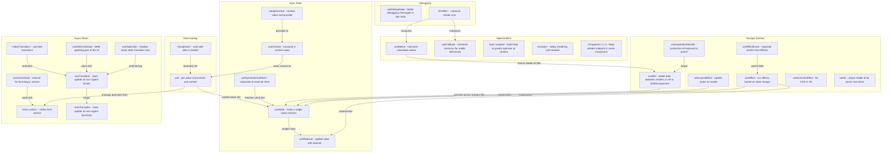

# React Concepts 

```mermaid
flowchart TB
    subgraph Debugging["Debugging"]
        useDebugValue["useDebugValue - better debugging messages in dev tools"]
        Profiler["&lt;Profiler&gt; - measure render cost"]
    end

    subgraph Optimizations["Optimizations"]
        useMemo["useMemo - memoize calculated values"]
        useCallback["useCallback - memoize functions for stable references"]
        reactCompiler["react compiler - build step to greatly optimize at runtime"]
        Activity["&lt;Activity&gt; - delay rendering until needed"]
        Fragment["&lt;Fragment&gt; (&lt;&gt;) - keep related subparts in same component"]
    end

    subgraph EscapeHatches["Escape hatches"]
        useLayoutEffect["useLayoutEffect - update styles on render"]
        useEffect["useEffect - run effects based on state change"]
        useEffectEvent["useEffectEvent - separate events from Effects"]
        useRef["useRef - stable data between renders or ref to DOM/component"]
        useImperativeHandle["useImperativeHandle - customize ref exposed to parent"]
        useInsertionEffect["useInsertionEffect - for CSS-in-JS"]
        useId["useId - unique stable id for server and client"]
    end

    subgraph SyncState["Sync State"]
        createContext["createContext - context value and provider"]
        useContext["useContext - consume a context value"]
        useState["useState - make a single value reactive"]
        useReducer["useReducer - update state with reducer"]
        useSyncExternalStore["useSyncExternalStore - subscribe to external store"]
    end

    subgraph DataLoading["Data loading"]
        Suspense["&lt;Suspense&gt; - wait until data is loaded"]
        use["use - get value of promises and context"]
    end

    subgraph AsyncReact["Async React"]
        formAction["&lt;form action&gt; - native form actions"]
        startTransition["startTransition - mark update as non-urgent (function)"]
        useTransition["useTransition - mark update as non-urgent (hook)"]
        useActionState["useActionState - reducer for form/async actions"]
        useDeferredValue["useDeferredValue - defer updating part of the UI"]
        useOptimistic["useOptimistic - shadow value while transition runs"]
        ViewTransition["&lt;ViewTransition&gt; - animate transitions"]
    end

    %% Debugging ↔ Optimizations
    Profiler -->|measures| useMemo
    Profiler -->|measures| useCallback

    %% Escape hatches ↔ Sync State
    useEffect -->|reads/writes| useState
    useEffect -->|reads/writes| useReducer
    useLayoutEffect -->|reads/writes| useState
    useRef -->|persists across renders like| useState
    useImperativeHandle -->|wraps| useRef

    %% Escape hatches ↔ Optimizations
    useEffectEvent -->|used inside| useEffect
    useMemo -->|returns stable ref like| useRef

    %% Sync State internal
    createContext -->|provides to| useContext
    useState -->|simpler than| useReducer
    useSyncExternalStore -->|reactive value like| useState

    %% Sync State ↔ Data loading
    useContext -->|same source as| use
    use -->|loaded value into| useState

    %% Data loading ↔ Async React
    Suspense -->|boundary for| use
    use -->|unwraps promises from| formAction
    useTransition -->|wraps| startTransition
    useActionState -->|used with| formAction
    useOptimistic -->|used during| useTransition
    useDeferredValue -->|pairs with| useTransition
    ViewTransition -->|animates| useTransition
```

