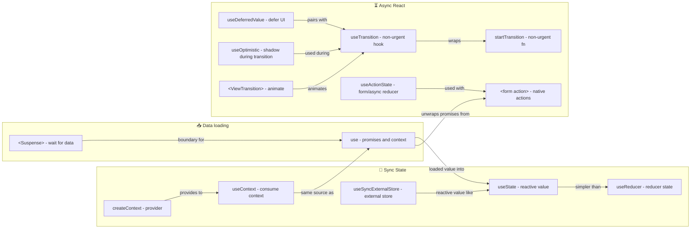

# React Concepts 

```mermaid
flowchart TD
    %% Debugging, Optimizations, Escape hatches
    subgraph Debugging["🔍 Debugging"]
        direction TB
        useDebugValue["useDebugValue - better debugging in dev tools"]
        Profiler["&lt;Profiler&gt; - measure render cost"]
    end

    subgraph Optimizations["⚡ Optimizations"]
        direction TB
        useMemo["useMemo - memoize values"]
        useCallback["useCallback - stable refs"]
        reactCompiler["react compiler - runtime optimize"]
        Activity["&lt;Activity&gt; - delay render"]
        Fragment["&lt;Fragment&gt; - group subparts"]
    end

    subgraph EscapeHatches["🚪 Escape hatches"]
        direction TB
        useLayoutEffect["useLayoutEffect - styles on render"]
        useEffect["useEffect - effects on state"]
        useEffectEvent["useEffectEvent - events vs Effects"]
        useRef["useRef - stable ref or DOM"]
        useImperativeHandle["useImperativeHandle - customize ref"]
        useInsertionEffect["useInsertionEffect - CSS-in-JS"]
        useId["useId - stable id SSR/client"]
    end

    %% Profiler -->|measures| useMemo
    %% Profiler -->|measures| useCallback
    %% useEffectEvent -->|used inside| useEffect
    %% useImperativeHandle -->|wraps| useRef
    %% useMemo -->|returns stable ref like| useRef
```

```mermaid
flowchart LR
    %% Sync State, Data loading, Async React

    subgraph SyncState["🔄 Sync State"]
        direction LR
        createContext["createContext - provider"]
        useContext["useContext - consume context"]
        useState["useState - reactive value"]
        useReducer["useReducer - reducer state"]
        useSyncExternalStore["useSyncExternalStore - external store"]
    end

    subgraph DataLoading["📥 Data loading"]
        direction LR
        Suspense["&lt;Suspense&gt; - wait for data"]
        use["use - promises and context"]
    end

    subgraph AsyncReact["⏳ Async React"]
        direction LR
        formAction["&lt;form action&gt; - native actions"]
        startTransition["startTransition - non-urgent fn"]
        useTransition["useTransition - non-urgent hook"]
        useActionState["useActionState - form/async reducer"]
        useDeferredValue["useDeferredValue - defer UI"]
        useOptimistic["useOptimistic - shadow during transition"]
        ViewTransition["&lt;ViewTransition&gt; - animate"]
    end

    %% Layout
    DataLoading ~~~ SyncState  ~~~ AsyncReact

    %% Sync State internal
    createContext -->|provides to| useContext
    useState -->|simpler than| useReducer
    useSyncExternalStore -->|reactive value like| useState

    %% Sync State ↔ Data loading
    useContext -->|same source as| use
    use -->|loaded value into| useState

    %% Data loading ↔ Async React
    Suspense -->|boundary for| use
    use -->|unwraps promises from| formAction
    useTransition -->|wraps| startTransition
    useActionState -->|used with| formAction
    useOptimistic -->|used during| useTransition
    useDeferredValue -->|pairs with| useTransition
    ViewTransition -->|animates| useTransition
```

