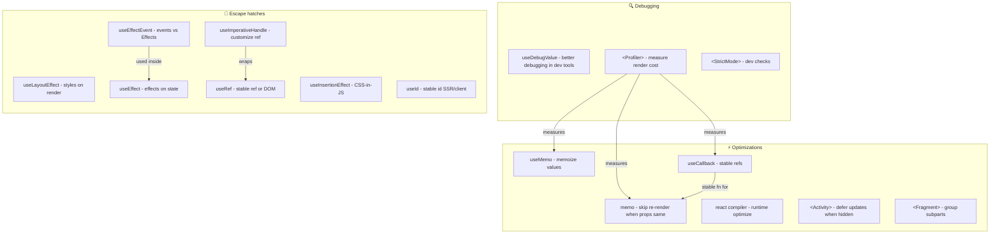
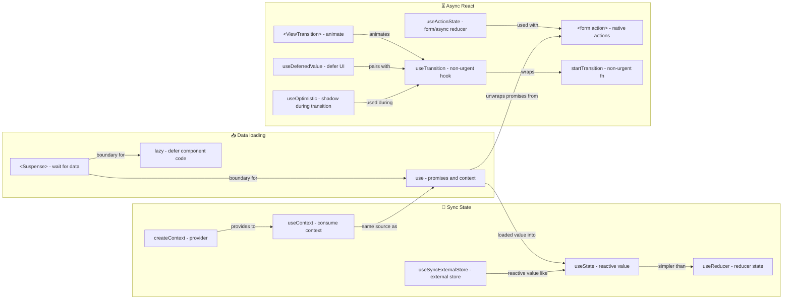

# React Concepts

High-level map of React concepts: debugging, optimizations, escape hatches, sync state, data loading, and async patterns. Use this to see how APIs fit together; for hook details and async flows see the links below.

**See also:** [hooks.md](hooks.md) (hook reference), [async-react.md](async-react.md) (async patterns).

