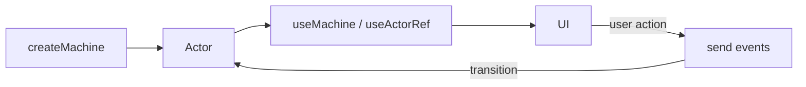
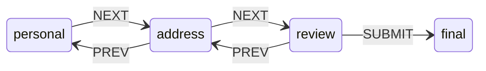

# XState in React

XState gives you predictable state and flows in React via state machines and actors. (XState v5: use `createMachine`, `machine.provide()`, and `snapshot` in options for persistence.)




## Installation

```bash
npm i xstate @xstate/react
```

## Quick start: machine in a component

Define a machine with `createMachine`, then run it in a component with `useMachine`:

```ts
import { createMachine } from 'xstate';
import { useMachine } from '@xstate/react';

const toggleMachine = createMachine({
  id: 'toggle',
  initial: 'inactive',
  states: {
    inactive: { on: { TOGGLE: 'active' } },
    active: { on: { TOGGLE: 'inactive' } },
  },
});

function Toggler() {
  const [snapshot, send] = useMachine(toggleMachine);
  return (
    <button onClick={() => send('TOGGLE')}>
      {snapshot.value === 'inactive' ? 'Off' : 'On'}
    </button>
  );
}
```

## State machine configuration

Everything you can set in a machine and in each state. Implementations for `actions`, `actors`, `guards`, and `delays` are often passed later via `machine.provide({ ... })`.

### Top-level (machine root)


| Property    | Purpose                                                                                         |
| ----------- | ----------------------------------------------------------------------------------------------- |
| **id**      | String identifier for the machine (e.g. for logging, devtools).                                 |
| **initial** | Starting state key (e.g. `'idle'`) or transition object.                                        |
| **context** | Extended state: object or `({ input }) => ({ ... })` factory. Updated with the `assign` action. |
| **states**  | Map of state keys to state configs (see below).                                                 |
| **on**      | Machine-level events: any state can react to these unless a nested state overrides.             |
| **types**   | (TypeScript) Typing for `context`, `events`, `input`, `output`.                                 |
| **output**  | Value or function for the machine’s output when it reaches a final state.                       |


### Per-state (inside `states.foo`)


| Property        | Purpose                                                                                                                                                               |
| --------------- | --------------------------------------------------------------------------------------------------------------------------------------------------------------------- |
| **on**          | Event map: `{ EVENT: 'targetState' }` or `{ EVENT: { target: 'x', guard: 'g', actions: ['a'] } }`. Use an array for multiple transitions (first matching guard wins). |
| **initial**     | For compound states: which child state to enter (e.g. `'loading'`).                                                                                                   |
| **entry**       | Action(s) run when entering this state (string name or array of names).                                                                                               |
| **exit**        | Action(s) run when exiting this state.                                                                                                                                |
| **invoke**      | Actor(s) to spawn in this state (promise, callback, machine). Use `src`, `input`, `onDone`, `onError`.                                                                |
| **after**       | Delayed transitions: `{ 1000: 'timeout', 5000: 'fail' }` (ms → target). Delay names go in `machine.provide({ delays: { ... } })`.                                     |
| **always**      | Eventless (transient) transitions: checked whenever state is entered or context changes; first matching guard wins.                                                   |
| **type**        | `'final'` — state is terminal; parent gets `done.state.id`. Omit or use compound/parallel by structure.                                                               |
| **states**      | Nested states (compound or parallel).                                                                                                                                 |
| **tags**        | Array of tags (e.g. `['loading']`) for `snapshot.hasTag('loading')`.                                                                                                  |
| **meta**        | Arbitrary data (e.g. for UI labels).                                                                                                                                  |
| **description** | Human-readable description (docs, devtools).                                                                                                                          |


### Per-transition (inside `on.EVENT` or array item)


| Property    | Purpose                                                                                                         |
| ----------- | --------------------------------------------------------------------------------------------------------------- |
| **target**  | State key to transition to. Omit to re-enter current state (run actions only).                                  |
| **guard**   | Condition: string (implemented in `.provide({ guards: { ... } })`) or inline `({ context, event }) => boolean`. |
| **actions** | Action(s) to run when this transition is taken (string or array).                                               |
| **reenter** | (v5) If true, re-enter the same state (exit/entry run again).                                                   |


### Provided via `machine.provide({ ... })`


| Key         | Purpose                                                                                           |
| ----------- | ------------------------------------------------------------------------------------------------- |
| **actions** | Implementation of named actions: `{ doSomething: ({ context, event }) => { ... } }`.              |
| **actors**  | Implementation of invoked actors: `{ fetchUser: fromPromise(...) }` or `fromCallback(...)`, etc.  |
| **guards**  | Implementation of named guards: `{ isValid: ({ context, event }) => boolean }`.                   |
| **delays**  | Implementation of named delays for `after`: `{ slow: 3000 }` or `({ context, event }) => number`. |


### Full example using every option

```ts
import { createMachine, assign, fromPromise } from 'xstate';

const exampleMachine = createMachine({
  // --- Top-level ---
  id: 'example',                                    // identifier for devtools / logging
  initial: 'idle',                                  // starting state
  context: { count: 0, data: null, error: null },   // extended state; update with assign()
  output: ({ context }) => ({ data: context.data }), // value when machine reaches a final state
  // types: {} as { context: ..., events: ..., input: ... },  // TypeScript: type the machine
  on: { RESET: { target: 'idle', actions: 'resetContext' } }, // machine-level: any state can react
  states: {
    idle: {
      description: 'Waiting for user to start',
      entry: 'logEnterIdle',   // run when entering this state
      exit: 'logExitIdle',     // run when leaving this state
      always: [
        // eventless (transient) transition; checked on enter / when context changes
        { guard: ({ context }) => context.count >= 99, target: 'success' },
      ],
      on: {
        START: [
          {
            target: 'loading',
            guard: 'canStart',           // named guard (implemented in .provide)
            actions: assign({ count: (ctx) => ctx.count + 1 }),
          },
          {
            guard: ({ context }) => context.count < 0, // inline guard: stay, run action only
            actions: 'logBlocked',
          },
        ],
      },
    },
    loading: {
      initial: 'fetching',     // compound state: which child to enter first
      tags: ['loading'],       // snapshot.hasTag('loading')
      meta: { label: 'Loading…' },
      entry: 'logEnterLoading',
      exit: 'logExitLoading',
      invoke: {
        src: 'fetchData',
        input: ({ context }) => ({ count: context.count }),
        onDone: { target: 'success', actions: assign({ data: ({ event }) => event.output }) },
        onError: { target: 'idle', actions: assign({ error: ({ event }) => event.error }) },
      },
      after: {
        timeout: 'idle',       // named delay → transition after delay (see .provide delays)
      },
      states: {
        fetching: {},
        retrying: { entry: 'logRetry' },
      },
      on: {
        REFRESH: { reenter: true }, // v5: re-enter this state (exit + entry run again)
      },
    },
    success: {
      type: 'final',           // terminal state; parent receives done.state.id
      entry: 'notifySuccess',
      data: ({ context }) => ({ result: context.data }), // output for this final state
    },
  },
}).provide({
  actions: {
    logEnterIdle: () => console.log('entered idle'),
    logExitIdle: () => console.log('exited idle'),
    logEnterLoading: () => console.log('entered loading'),
    logExitLoading: () => console.log('exited loading'),
    logRetry: () => console.log('retrying'),
    logBlocked: () => console.log('start blocked'),
    resetContext: assign({ count: 0, data: null, error: null }),
    notifySuccess: () => {},
  },
  guards: {
    canStart: ({ context }) => context.count >= 0,
  },
  actors: {
    fetchData: fromPromise(({ input }) =>
      fetch(`/api?count=${input.count}`).then((r) => r.json()),
    ),
  },
  delays: {
    timeout: 5000, // used by loading.after.timeout
  },
});
```

## XState API functions

Core functions from the `xstate` package. Use them to define machines, update context, send events, and create actors.

### Quick reference

| API | Purpose |
|-----|---------|
| **createMachine(config, options?)** | Create a state machine from config. Optional 2nd arg: `{ actions, guards, actors, delays }`. |
| **setup({ types?, actions?, guards?, actors?, delays? })** | Define types and named implementations; returns `{ createMachine }` for typed machines. |
| **machine.provide(impl)** | Return a new machine with overridden/added actions, guards, actors, delays. |
| **createActor(actorLogic, options?)** | Create a running actor from a machine or other logic. Options: `input`, `snapshot`. Call `.start()`. |
| **assign(assignments)** | Action: update context immutably. Pass object or `({ context, event }) => partialContext`. |
| **raise(event \| fn)** | Action: send an event to the same machine (self). Option: `{ delay: ms }`. |
| **enqueueActions(callback)** | Action: run multiple actions in order. Callback gets `{ context, event, enqueue, check }`; use `enqueue.assign()`, `enqueue.raise()`, `enqueue.sendTo()`, etc. |
| **log(message \| fn)** | Action: log a message. Pass string or `({ context, event }) => string`. |
| **sendTo(actorIdOrRef, event, options?)** | Action: send an event to another actor. Options: `{ delay, id }` (id for cancel). |
| **sendParent(event)** | Action: send an event to the parent actor (when machine is invoked). |
| **cancel(id)** | Action: cancel a delayed `sendTo` or `raise` by its `id`. |
| **fromPromise(fn)** | Actor logic from an async function. Receives `input`; resolves to `output`. |
| **fromCallback(fn)** | Actor logic from a callback; receives `({ sendBack })` to send events to parent. |
| **fromTransition(transition, initial)** | Actor logic from a pure transition function `(state, event) => newState`. |

### createMachine(config, options?)

Creates a state machine. Config: `id`, `initial`, `context`, `states`, `on`, etc. Optional second argument (v4 style) can supply implementations; in v5 you often use `machine.provide({ ... })` instead.

```ts
import { createMachine } from 'xstate';

const machine = createMachine({
  id: 'app',
  initial: 'idle',
  context: { count: 0 },
  states: {
    idle: { on: { START: 'active' } },
    active: { on: { STOP: 'idle' } },
  },
});
```

### setup({ types?, actions?, guards?, actors?, delays? })

Use for TypeScript types and named implementations. Returns an object with `.createMachine(config)` so the machine is typed and all named sources are declared up front.

```ts
import { setup, assign } from 'xstate';

const machine = setup({
  types: {
    context: {} as { count: number },
    events: {} as { type: 'inc' } | { type: 'dec' },
  },
  actions: {
    increment: assign({ count: ({ context }) => context.count + 1 }),
    decrement: assign({ count: ({ context }) => context.count - 1 }),
  },
  guards: {
    atMax: ({ context }) => context.count >= 10,
  },
}).createMachine({
  context: { count: 0 },
  on: {
    inc: { actions: 'increment' },
    dec: { actions: 'decrement' },
  },
});
```

### machine.provide(implementations)

Returns a new machine with the same config but with overridden or added implementations. Use for dependency injection or different behavior per environment.

```ts
const machineWithImpl = machine.provide({
  actions: { notify: () => toast('Done!') },
  guards: { atMax: ({ context }) => context.count >= 100 },
  actors: { fetchData: fromPromise(() => fetch('/api').then((r) => r.json())) },
  delays: { slow: 3000 },
});
```

### createActor(actorLogic, options?)

Creates a running actor from machine or other actor logic (e.g. `fromPromise`). Options: `input` (for machines/actors that accept input), `snapshot` (to rehydrate). Call `.start()` to run; use `.send(event)` to send events; subscribe with `.subscribe(snapshot => ...)`.

```ts
import { createActor, createMachine } from 'xstate';

const machine = createMachine({ /* ... */ });
const actor = createActor(machine, { input: { userId: 1 } });
actor.subscribe((snapshot) => console.log(snapshot.value, snapshot.context));
actor.start();
actor.send({ type: 'START' });
```

### assign(assignments)

Updates context. Pass an object: keys are context keys, values are static or functions `({ context, event }) => value`. Or pass a single function `({ context, event }) => ({ ...context, key: value })` that returns the new context (or a partial for shallow merge).

```ts
import { createMachine, assign } from 'xstate';

// Object form: each key is a context property
assign({
  count: ({ context }) => context.count + 1,
  lastEvent: ({ event }) => event.type,
});

// Function form: return full or partial context
assign(({ context, event }) => ({
  ...context,
  history: [...context.history, event],
}));
```

### raise(event | fn)

Sends an event to the same machine (self). Processed after the current transition. Use for chaining or internal triggers. Optional second argument: `{ delay: ms }` to send after a delay.

```ts
import { createMachine, raise } from 'xstate';

createMachine({
  entry: raise({ type: 'CHECK' }),
  on: {
    CHECK: { /* ... */ },
  },
});

// Dynamic event
raise(({ context }) => ({ type: 'ALERT', code: context.errorCode }));

// Delayed (not in internal queue)
raise({ type: 'TIMEOUT' }, { delay: 5000 });
```

### enqueueActions(callback)

Runs multiple actions in sequence. Callback receives `{ context, event, enqueue, check }`. Use `enqueue(...)` for custom actions and `enqueue.assign()`, `enqueue.raise()`, `enqueue.sendTo()` for built-ins. Use `check(guard)` to conditionally enqueue.

```ts
import { createMachine, enqueueActions } from 'xstate';

createMachine({
  entry: enqueueActions(({ context, event, enqueue, check }) => {
    enqueue.assign({ count: context.count + 1 });
    if (event.needsNotify) {
      enqueue.raise({ type: 'NOTIFY' });
    }
    enqueue('logToAnalytics');
  }),
});
```

### log(message | fn)

Built-in action that logs. Pass a string or a function `({ context, event }) => string`.

```ts
import { createMachine, log } from 'xstate';

createMachine({
  entry: log('entered state'),
  on: {
    SUBMIT: {
      actions: log(({ context, event }) => `Submit: ${JSON.stringify(context)}`),
    },
  },
});
```

### sendTo(actorIdOrRef, event, options?)

Sends an event to another actor by id (string) or actor ref. Options: `{ delay: ms, id: string }`. Use `id` with `cancel(id)` to cancel a delayed send.

```ts
import { createMachine, sendTo, cancel } from 'xstate';

createMachine({
  invoke: { id: 'child', src: childMachine },
  on: {
    TELL_CHILD: {
      actions: sendTo('child', { type: 'UPDATE', data: 1 }),
    },
    TELL_LATER: {
      actions: sendTo('child', { type: 'PING' }, { delay: 1000, id: 'ping' }),
    },
    CANCEL_PING: { actions: cancel('ping') },
  },
});
```

### cancel(id)

Cancels a delayed action (e.g. from `sendTo(..., { id })` or `raise(..., { id })`) by its `id`.

```ts
import { cancel } from 'xstate';
// use in actions: cancel('timeoutId')
```

### fromPromise(fn)

Creates actor logic from an async function. The function receives `{ input }` and returns a promise; the actor’s `output` is the resolved value. Use in `invoke.src` or `setup({ actors: { fetchUser: fromPromise(...) } })`.

```ts
import { fromPromise } from 'xstate';

const fetchUser = fromPromise(async ({ input }: { input: { id: string } }) => {
  const res = await fetch(`/api/users/${input.id}`);
  return res.json();
});

// In machine
invoke: {
  src: fetchUser,
  input: { id: '1' },
  onDone: { target: 'loaded', actions: assign({ user: ({ event }) => event.output }) },
  onError: { target: 'error' },
}
```

### fromCallback(fn)

Creates actor logic from a callback. The callback receives `({ sendBack })`; call `sendBack(event)` to send events to the parent. Use for subscriptions, intervals, or WebSockets.

```ts
import { fromCallback } from 'xstate';

const ticker = fromCallback(({ sendBack }) => {
  const id = setInterval(() => sendBack({ type: 'TICK' }), 1000);
  return () => clearInterval(id); // cleanup
});

// In machine
invoke: {
  src: ticker,
  on: {
    TICK: { actions: assign({ ticks: ({ context }) => context.ticks + 1 }) },
  },
}
```

### fromTransition(transition, initialState)

Creates actor logic from a pure reducer: `(state, event) => newState`. Second argument is the initial state. Good for simple, synchronous state.

```ts
import { fromTransition } from 'xstate';

const counterLogic = fromTransition(
  (state: number, event: { type: 'inc' } | { type: 'dec' }) => {
    if (event.type === 'inc') return state + 1;
    if (event.type === 'dec') return state - 1;
    return state;
  },
  0
);
```

## General XState + React


| Hook                                                        | What it does                                                                                                                                                                                        |
| ----------------------------------------------------------- | --------------------------------------------------------------------------------------------------------------------------------------------------------------------------------------------------- |
| **useMachine(machine, options?)**                           | Creates an actor from the machine for the component’s lifetime. Returns `[snapshot, send, actorRef]`. Re-renders on every state change. [→ Full description & examples](#usemachinemachine-options) |
| **useActor(actorLogic, options?)**                          | Same as useMachine but for any actor logic (e.g. `fromPromise`, custom machines). Returns `[snapshot, send, actorRef]`. [→ Full description & examples](#usemachinemachine-options)                 |
| **useActorRef(actorLogic, options?)**                       | Creates the actor but returns only `actorRef`; component does not re-render on state change. Use with **useSelector** to read state. [→ Full description & examples](#useactorref--useselector)     |
| **useSelector(actorRef, selector, compare?, getSnapshot?)** | Subscribes to a slice of the actor’s snapshot. Re-renders only when the selected value changes (by reference or optional `compare`). [→ Full description & examples](#useactorref--useselector)     |
| **createActorContext(logic)**                               | Not a hook. Returns `{ Provider, useActorRef, useSelector }` so one actor can be shared down the tree. [→ Full description & examples](#createactorcontextlogic)                                    |


### useMachine(machine, options?)

The main hook for “run this machine in this component.” Returns `[snapshot, send, actorRef]`.

- **snapshot**: current state (use `snapshot.value`, `snapshot.context`, `snapshot.matches(...)`).
- **send**: send events to the machine. Use `send('EVENT')` or `send({ type: 'EVENT', payload })`.
- **actorRef**: the running actor (third element); use for subscriptions or with `useSelector`.

```tsx
const [snapshot, send] = useMachine(counterMachine);

// Event with no payload
send('INCREMENT');

// Event with payload
send({ type: 'SET_COUNT', value: 10 });
```

### useActorRef + useSelector

Use **useActorRef** when you want the actor but not automatic re-renders on every state change (e.g. for logging or to minimize re-renders). Read state with **useSelector** so only selected slices trigger re-renders.

```tsx
import { useActorRef, useSelector } from '@xstate/react';

const selectCount = (s) => s.context.count;

function Counter() {
  const actorRef = useActorRef(counterMachine);
  const count = useSelector(actorRef, selectCount);

  return (
    <button onClick={() => actorRef.send('INCREMENT')}>
      Count: {count}
    </button>
  );
}
```

### createActorContext(logic)

Share one machine instance across the tree. Put the provider at app or wizard scope; children use the context’s hooks.

```tsx
import { createActorContext } from '@xstate/react';

const CounterContext = createActorContext(counterMachine);

function App() {
  return (
    <CounterContext.Provider>
      <CounterDisplay />
      <CounterButtons />
    </CounterContext.Provider>
  );
}

function CounterDisplay() {
  const count = CounterContext.useSelector((s) => s.context.count);
  return <p>Count: {count}</p>;
}

function CounterButtons() {
  const actorRef = CounterContext.useActorRef();
  return (
    <>
      <button onClick={() => actorRef.send('INCREMENT')}>+</button>
      <button onClick={() => actorRef.send('DECREMENT')}>-</button>
    </>
  );
}
```

### Matching state

- **Flat machines**: `snapshot.value === 'idle'`.
- **Hierarchical / parallel**: use `snapshot.matches('stateName')` or `snapshot.matches({ parent: 'child' })`.

```tsx
// if/else
if (snapshot.matches('idle')) return <Idle />;
if (snapshot.matches({ loading: 'user' })) return <LoadingUser />;

// switch for many states
switch (true) {
  case snapshot.matches('idle'):
    return <Idle />;
  case snapshot.matches('loading'):
    return <Loading />;
  case snapshot.matches('success'):
    return <Success />;
  default:
    return null;
}
```

### Configuring machines

Use `machine.provide()` to inject actions, actors, or guards. Pass the result to `useMachine` or to `createActorContext`.

```tsx
const [snapshot, send] = useMachine(
  fetchMachine.provide({
    actions: {
      notifySuccess: ({ context }) => onResolve(context.data),
    },
    actors: {
      fetchData: fromPromise(({ input }) => fetch(input.url).then((r) => r.json())),
    },
  }),
);
```

### Persisted and rehydrated state

Pass a previously saved snapshot so the machine starts from that state (e.g. from `localStorage`):

```tsx
const persisted = JSON.parse(localStorage.getItem('app-state'));

const [snapshot, send] = useMachine(someMachine, {
  snapshot: persisted,
});
```

## Multi-step forms

Model the wizard as a state machine: one state per step, events for NEXT, PREV, and SUBMIT. Keep form data in `context` and update it **as the user enters data**—send `UPDATE_`* events on every change (e.g. `onChange` / `onBlur`) so the machine is the single source of truth; use `assign` to merge payloads into context.

### Wizard state machine shape




### Machine and context

```ts
import { createMachine, assign } from 'xstate';

export const wizardMachine = createMachine({
  id: 'wizard',
  initial: 'personal',
  context: {
    personal: { name: '', email: '' },
    address: { street: '', city: '' },
  },
  states: {
    personal: {
      on: {
        NEXT: 'address',
        UPDATE_PERSONAL: {
          actions: assign({
            personal: ({ event }) => event.payload,
          }),
        },
      },
    },
    address: {
      on: {
        NEXT: 'review',
        PREV: 'personal',
        UPDATE_ADDRESS: {
          actions: assign({
            address: ({ event }) => event.payload,
          }),
        },
      },
    },
    review: {
      on: {
        PREV: 'address',
        SUBMIT: 'submitted',
      },
    },
    submitted: {
      type: 'final',
    },
  },
});
```

### Wizard UI with useMachine

Read form state from `snapshot.context` and send `UPDATE_*` on every field change so the machine holds the form state as the user types. Next/Prev only navigate; they don’t need to pass form data.

```tsx
import { useMachine } from '@xstate/react';
import { wizardMachine } from './wizardMachine';

function Wizard() {
  const [snapshot, send] = useMachine(wizardMachine);
  const step = snapshot.value;

  return (
    <form onSubmit={(e) => { e.preventDefault(); send('SUBMIT'); }}>
      {step === 'personal' && (
        <PersonalStep
          data={snapshot.context.personal}
          onChange={(data) => send({ type: 'UPDATE_PERSONAL', payload: data })}
          onNext={() => send('NEXT')}
        />
      )}
      {step === 'address' && (
        <AddressStep
          data={snapshot.context.address}
          onChange={(data) => send({ type: 'UPDATE_ADDRESS', payload: data })}
          onNext={() => send('NEXT')}
          onPrev={() => send('PREV')}
        />
      )}
      {step === 'review' && (
        <ReviewStep
          personal={snapshot.context.personal}
          address={snapshot.context.address}
          onPrev={() => send('PREV')}
        />
      )}
      {snapshot.matches('submitted') && <p>Done!</p>}
    </form>
  );
}

// Step component: controlled inputs that update the machine on every change
function PersonalStep({ data, onChange, onNext }) {
  return (
    <>
      <input
        value={data.name}
        onChange={(e) => onChange({ ...data, name: e.target.value })}
      />
      <input
        value={data.email}
        onChange={(e) => onChange({ ...data, email: e.target.value })}
      />
      <button type="button" onClick={onNext}>Next</button>
    </>
  );
}
```

### Validation with guards

Only allow NEXT when the current step is valid. Pass validity from React via the event, or compute it in the machine. Use two transitions for the same event: the first with a guard (go to next step), the second without a guard as a fallback (stay and set validation error in context).

```ts
// Guard in machine: only transition if event carries valid flag; fallback when guard fails
const wizardMachine = createMachine({
  context: {
    personal: { name: '', email: '' },
    address: { street: '', city: '' },
    stepError: null as string | null,
  },
  states: {
    personal: {
      on: {
        NEXT: [
          {
            target: 'address',
            guard: ({ event }) => event.valid === true,
            actions: assign({ stepError: null }),
          },
          {
            actions: assign({ stepError: 'Please fix errors before continuing' }),
          },
        ],
        // UPDATE_PERSONAL, etc.
      },
    },
    // ...
  },
});

// In React: validate then send
send({ type: 'NEXT', valid: isValid });
// Show snapshot.context.stepError in the step UI when guard failed
```

### Sharing the wizard with createActorContext

Use **createActorContext(wizardMachine)** so the wizard lives above step components; each step uses the context to read state and send events.

```tsx
const WizardContext = createActorContext(wizardMachine);

function WizardContainer() {
  return (
    <WizardContext.Provider>
      <WizardSteps />
    </WizardContext.Provider>
  );
}

function WizardSteps() {
  const snapshot = WizardContext.useSelector((s) => s);
  const actorRef = WizardContext.useActorRef();
  const step = snapshot.value;

  return (
    <>
      {step === 'personal' && (
        <PersonalStep
          data={snapshot.context.personal}
          onChange={(data) => actorRef.send({ type: 'UPDATE_PERSONAL', payload: data })}
          onNext={() => actorRef.send('NEXT')}
        />
      )}
      {/* ... other steps: onChange with UPDATE_* payload, onNext/onPrev/SUBMIT for navigation */}
    </>
  );
}
```

