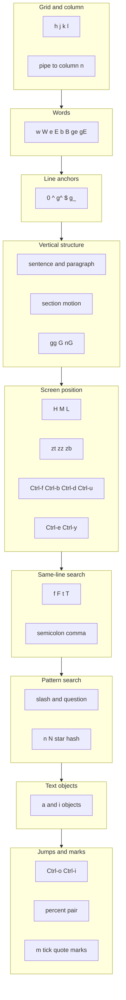
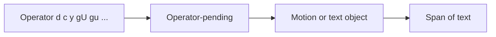

# Vim motions

A **motion** is a command that moves the cursor or defines a text range. Motions work in **Normal** mode, combine with **operators** (`d`, `c`, `y`, `gU`, …) in **operator-pending** mode, and extend selections in **Visual** mode. For window splits, buffers, and LazyVim-specific keys, see [my-neovim.md](my-neovim.md).

## Key legend

Symbols match [my-neovim.md](my-neovim.md): `⌃` Control, `⌥` Option/Alt, `⇧` Shift.

---

## Motion families



---

## Operators plus motion



Prefix a **count** before the operator or before the motion (e.g. `d3w`, `2de`) to repeat the motion that many times where it applies.

---

## Character grid

| Key     | Action                                      |
| ------- | ------------------------------------------- |
| `h`     | Left one character                          |
| `l`     | Right one character                         |
| `j`     | Down one line                               |
| `k`     | Up one line                                 |
| `{n}`   | Repeat next motion `n` times (e.g. `5j`)    |
| `\|` `{n}` | To column `n` (default 1)              |

`hjkl` compass (cursor at center):

```text
        k  (up)
        |
   h ---+--- l
(left)  |      (right)
        j
     (down)
```

---

## Words and WORDs

A **word** (`w`, `b`, `e`, …) is a sequence of keyword characters (`iskeyword`) or a sequence of non-keyword characters. A **WORD** (`W`, `B`, `E`, …) is a non-blank run separated by whitespace.

| Key  | Action                                      |
| ---- | ------------------------------------------- |
| `w`  | Forward to start of next word               |
| `W`  | Forward to start of next WORD               |
| `e`  | Forward to end of word                      |
| `E`  | Forward to end of WORD                      |
| `b`  | Back to start of word                       |
| `B`  | Back to start of WORD                       |
| `ge` | Back to end of previous word                |
| `gE` | Back to end of previous WORD                |

Example line (`^` = landing after each `w` from line start, step by step):

```text
one.two three
^   ^   ^
|   |   +-- third w
|   +------ second w
+---------- cursor at o: first w goes to .
```

`WORD` on the same line: `one.two` is **one** WORD; `w` steps inside `one.two` while `W` jumps past the whole token to `three`.

---

## Line anchors

| Key  | Action                                                |
| ---- | ----------------------------------------------------- |
| `0`  | Start of line (column 0)                              |
| `^`  | First non-blank on line                               |
| `g^` | First non-blank on screen line (with wrapping)        |
| `$`  | End of line                                           |
| `g_` | Non-blank char closest to end of line                 |
| `g$` | End of screen line (with wrapping)                    |
| `+`  | Down to first non-blank of next line                  |
| `-`  | Up to first non-blank of previous line                |
| `_`  | Down `n-1` lines, then first non-blank (like `+` count) |

```text
      first non-blank ----v
                          
    |    code_here;
    ^----+----------^----^
    |    |          |    |
    0    ^          $    g_
```

---

## Vertical structure and file

| Key     | Action                                      |
| ------- | ------------------------------------------- |
| `(`     | Back sentence                             |
| `)`     | Forward sentence                          |
| `{`     | Back paragraph                            |
| `}`     | Forward paragraph                         |
| `[[`    | Back start of section                     |
| `]]`    | Forward start of section                  |
| `[]`    | Back end of section                       |
| `][`    | Forward end of section                    |
| `[(` `])` | Unclosed `(` / `)` motion              |
| `gg`    | First line of buffer                      |
| `G`     | Last line (or line `n` with `nG`)         |
| `{n}G`  | Go to line number `n`                     |

---

## Screen position and scrolling

| Key       | Action                                      |
| --------- | ------------------------------------------- |
| `H`       | Top line of window                          |
| `M`       | Middle line of window                       |
| `L`       | Bottom line of window                       |
| `zt`      | Cursor line at top of window                |
| `zz` `z.` | Cursor line at center                       |
| `zb`      | Cursor line at bottom                       |
| `⌃e`      | Scroll window one line down                 |
| `⌃y`      | Scroll window one line up                   |
| `⌃f`      | Forward one window                          |
| `⌃b`      | Back one window                             |
| `⌃d`      | Down half window                            |
| `⌃u`      | Up half window                              |
| `z⌃j`     | Cursor on bottom line, scroll down          |
| `z⌃k`     | Cursor on top line, scroll up               |

---

## Same-line character search

| Key | Action                                                |
| --- | ----------------------------------------------------- |
| `f{c}` | Forward to **inclusive** next `{c}`                  |
| `F{c}` | Backward to inclusive previous `{c}`                 |
| `t{c}` | Forward **before** next `{c}`                        |
| `T{c}` | Backward **after** previous `{c}`                    |
| `;` | Repeat latest `f`, `F`, `t`, `T` in same direction   |
| `,` | Repeat latest `f`, `F`, `t`, `T` in opposite direction |

```text
find the x marker
     ^  ^    ^
     |  |    +-- T x (stops after x, backward from right)
     |  +------- t x (stops before x)
     +----------- f x (on x)
```

---

## Pattern search

| Key   | Action                                                |
| ----- | ----------------------------------------------------- |
| `/`   | Search forward                                      |
| `?`   | Search backward                                     |
| `n`   | Repeat last search in same direction                |
| `N`   | Repeat last search in opposite direction            |
| `*`   | Forward to next whole word under cursor               |
| `#`   | Backward to previous whole word under cursor        |
| `g*`  | Forward to next occurrence of word under cursor     |
| `g#`  | Backward to previous occurrence of word under cursor  |

`n` / `N` repeat the current search pattern (including the pattern that `*` / `#` / `g*` / `g#` last started).

---

## Text objects (inner vs around)

**Inner** (`i`) selects the innermost text unit; **around** (`a`) includes surrounding whitespace or delimiters (behavior varies by object).

| Object   | Keys        | Inner (`i`)              | Around (`a`)            |
| -------- | ----------- | ------------------------ | ----------------------- |
| Word     | `w` `W`     | Word / WORD              | Word + space            |
| Sentence | `s`         | Sentence                 | Sentence + space        |
| Paragraph| `p`         | Paragraph body           | Paragraph + blank lines |
| Quote    | `'` `"` `` ` `` | Inside quotes         | Quotes + contents       |
| Paren    | `b` `(` `)` | Inside `()`              | `(` … `)`               |
| Bracket  | `]` `[`     | Inside `[]`              | `[` … `]`               |
| Brace    | `B` `{` `}` | Inside `{}`              | `{` … `}`               |
| Angle    | `>` `<`     | Inside `<>`              | `<` … `>`               |
| Tag      | `t`         | XML/HTML tag inner       | Whole tag               |

`iw` vs `aw` on a line (selection conceptually):

```text
     leading   word   trailing
       |        |        |
       v        v        v
    ...  hello  world  ...
         [==iw==]        inner word only
       [====aw====]      around word includes space(s)
```

Use `a"` / `i"` for double-quoted strings; similarly `a'` `i'`, `` a` `` `` i` `` for other quotes.

---

## Jumps and navigation

| Key       | Action                                                |
| --------- | ----------------------------------------------------- |
| `%`       | Match next `()`, `{}`, `[]` pair (or `#if`/`#endif` in C) |
| `⌃o`      | Older position in **jump list**                     |
| `⌃i`      | Newer position in jump list                           |
| `g;`      | Older position in **changelist**                      |
| `g,`      | Newer position in changelist                          |
| `''` | Line of the position before the latest jump (first non-blank) |
| `` `{a-z} `` | Exact line and column of mark `{a-z}`              |
| `'{a-z}` | Line of mark `{a-z}`, first non-blank on line          |

Jumps that move far (file, search, `G`, etc.) add to the jump list; small motions (`h` `j` within a line) usually do not.

---

## Marks

| Key        | Action                                                |
| ---------- | ----------------------------------------------------- |
| `m{a-zA-Z}` | Set mark: lowercase buffer-local, uppercase global  |
| `` `{mark} `` | Jump to mark (line + column)                      |
| `'{mark}` | Jump to line of mark (first non-blank)                |
| `` `[ `` `` `] `` | Start/end of last change or yank                  |
| `` `< `` `` `> `` | Start/end of last visual selection                |

---

## Quick reference

| Topic        | Primary keys                                      |
| ------------ | ------------------------------------------------- |
| Grid         | `h` `j` `k` `l` `\|`                              |
| Words        | `w` `W` `e` `E` `b` `B` `ge` `gE`                |
| Line         | `0` `^` `$` `g_` `+` `-`                          |
| File / block | `gg` `G` `{` `}` `(` `)` `[[` `]]`                |
| Screen       | `H` `M` `L` `zt` `zz` `zb` `⌃f` `⌃b` `⌃d` `⌃u`   |
| Line search  | `f` `F` `t` `T` `;` `,`                           |
| Pattern      | `/` `?` `n` `N` `*` `#`                           |
| Text object  | `i` / `a` with `w` `s` `p` quotes `(` `)` `{` `}` `[` `]` `<` `>` `t` |
| Jump / mark  | `%` `⌃o` `⌃i` `m` backtick `'` marks                    |
